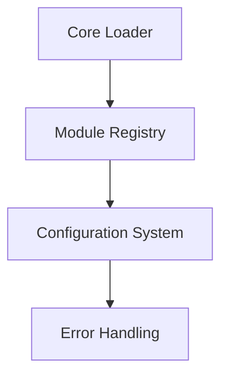
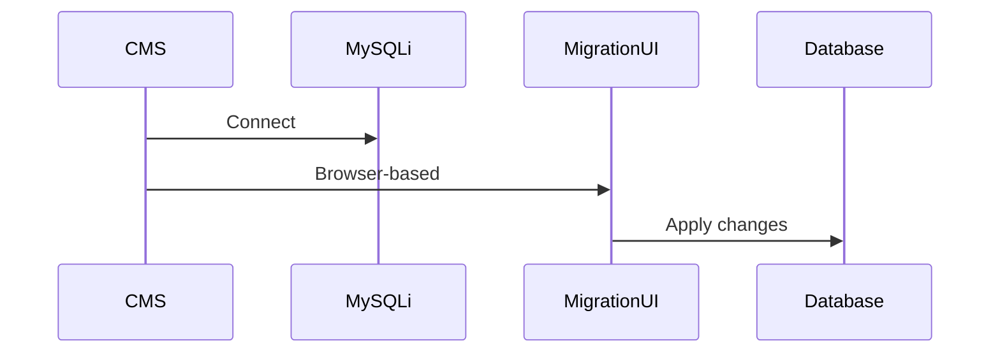
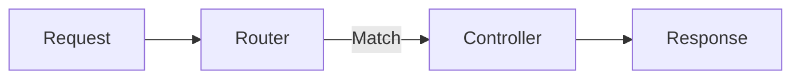
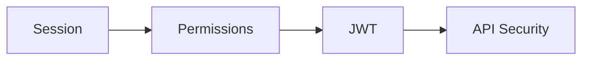
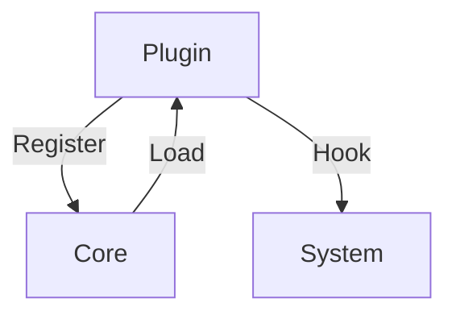

# Phase 1 Implementation Plan

## Core System Architecture

### 1. Basic Architecture

**Tasks:**
1. Create core loader (`/core/bootstrap.php`)
   - Initialize JSON configuration system
   - Setup error handling
   - Load module registry
2. Implement module registry system
   - JSON manifest files for modules
   - Hot-loading capability
3. Create shared utilities
   - JSON file reader/writer
   - Basic logging system

**Dependencies:** None (foundational)

### 2. Database Layer

**Tasks:**
1. Implement MySQLi wrapper class
   - Connection management
   - Query builder
   - Error handling
2. Create browser-based migration system
   - JSON migration files
   - Version tracking
   - Rollback capability
3. Develop tenant-aware query system
   - Site ID injection
   - Query filtering

**Dependencies:** Basic Architecture (for config/error handling)

### 3. Routing System

**Tasks:**
1. Implement file-based router
   - Route definition in JSON
   - REST endpoint mapping
2. Create response formatter
   - JSON output standardization
   - Error response handling
3. Build request processor
   - Input sanitization
   - Parameter binding

**Dependencies:** Basic Architecture, Database Layer

### 4. Authentication Core

**Tasks:**
1. Implement session-based auth
   - Login/logout handlers
   - CSRF protection
2. Build permission registry
   - JSON permission definitions
   - Role-based access
3. Add JWT support
   - API token generation
   - Stateless validation

**Dependencies:** Routing System, Database Layer

### 5. Plugin Architecture

**Tasks:**
1. Design plugin manifest format
   - JSON definition files
   - Dependency specification
2. Implement sandbox system
   - Isolated execution
   - API whitelisting
3. Build admin interface
   - Plugin management
   - Activation/deactivation

**Dependencies:** All previous phases

## Implementation Sequence

1. Basic Architecture (Week 1-2)
2. Database Layer (Week 3-4)
3. Routing System (Week 5)
4. Authentication Core (Week 6)
5. Plugin Architecture (Week 7-8)

## Verification Checklist
- [ ] All components work without CLI
- [ ] No Composer/Node.js dependencies
- [ ] JSON used for all configurations
- [ ] Shared hosting compatibility verified