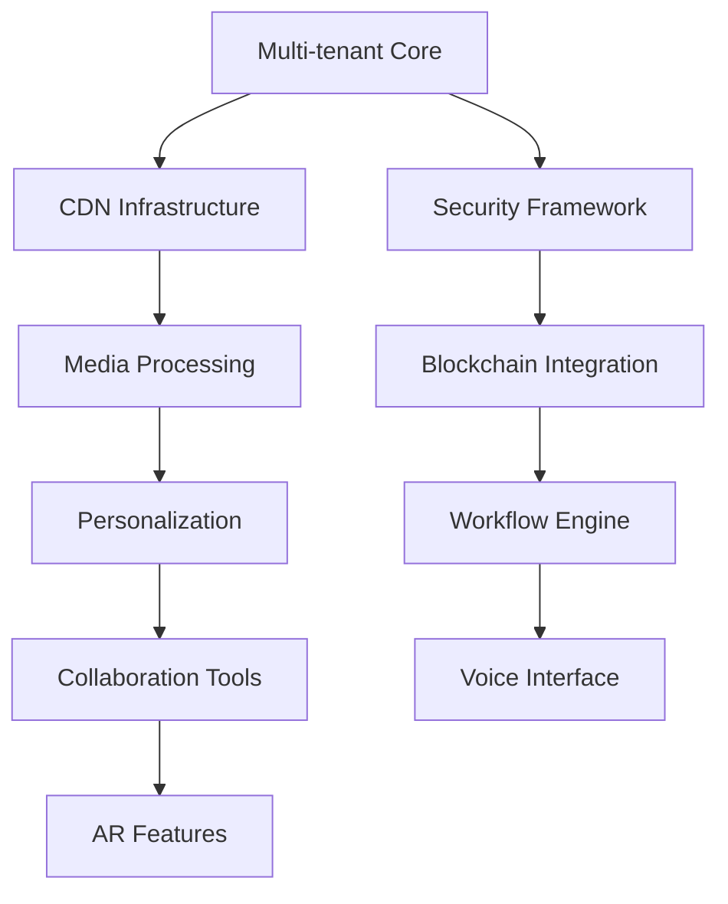

# Phase 22 Implementation Plan

## Feature Components

### 1. Global Content Delivery Network
- EdgeCacheService (file-based with CDN fallback)
- GeoDNSRouter (PHP implementation)
- AssetVersionManager (content fingerprinting)
- HealthMonitor (uptime tracking)
- PerformanceLogger (metrics collection)

### 2. Advanced Personalization Engine  
- BehaviorTracker (cookie-based)
- RecommendationService (REST API to AI)
- TargetingEngine (rule-based)
- ABTestManager (statistical analysis)
- PreferenceStorage (encrypted cookies)

### 3. Multi-tenant Architecture
- TenantIsolator (namespace separation)
- ResourceQuotaManager
- BrandingEngine (CSS/logo injection)
- ConfigOverrideSystem
- CrossTenantAnalytics (aggregated)

### 4. Enhanced Media Processing
- TranscoderService (FFmpeg via API)
- ImageOptimizer (PHP-GD)
- DigitalAssetManager
- MetadataExtractor
- ThumbnailGenerator

### 5. Workflow Orchestration
- VisualDesigner (SVG-based)
- ConditionEvaluator
- ApprovalGateway
- ErrorHandler
- WorkflowAnalytics

### 6. Real-time Collaboration
- CoEditingService (Operational transforms)
- PresenceTracker (WebSocket fallback)
- CommentThreader
- ChangeLogger
- NotificationDispatcher

### 7. Blockchain Integration
- ContentHasher (SHA-3)
- SignatureService
- AuditTrailLogger
- SmartContractProxy (REST)
- IPFSStorageAdapter

### 8. Voice Interface
- VoiceCommandParser
- STTService (API integration)
- VoiceSearchIndex
- AudioPlayer
- AccessibilityEnhancer

### 9. Augmented Reality
- ARMarkerGenerator
- ModelRenderer (WebGL fallback)
- DeviceAPIWrapper
- SpatialTracker
- ARPreviewService

### 10. Quantum-resistant Security
- PQCryptography (libsodium)
- KeyRotator
- SecureEnclaveProxy
- HSMConnector
- ThreatModelAnalyzer

## Implementation Sequence

## Technical Considerations
1. Shared Hosting Constraints:
   - No CLI tools
   - No long-running processes
   - Limited memory/CPU
   - FTP deployment only

2. Performance:
   - Heavy features must be API-driven
   - Batch processing for intensive tasks
   - Client-side processing where possible

3. Security:
   - All external integrations must use REST
   - No direct database access from client
   - Input validation for all endpoints

## Review Checklist
- [ ] Verify framework-free compliance
- [ ] Confirm shared hosting compatibility  
- [ ] Validate API rate limiting
- [ ] Check rollback safety
- [ ] Test memory limits
- [ ] Verify GDPR compliance
- [ ] Document all external dependencies