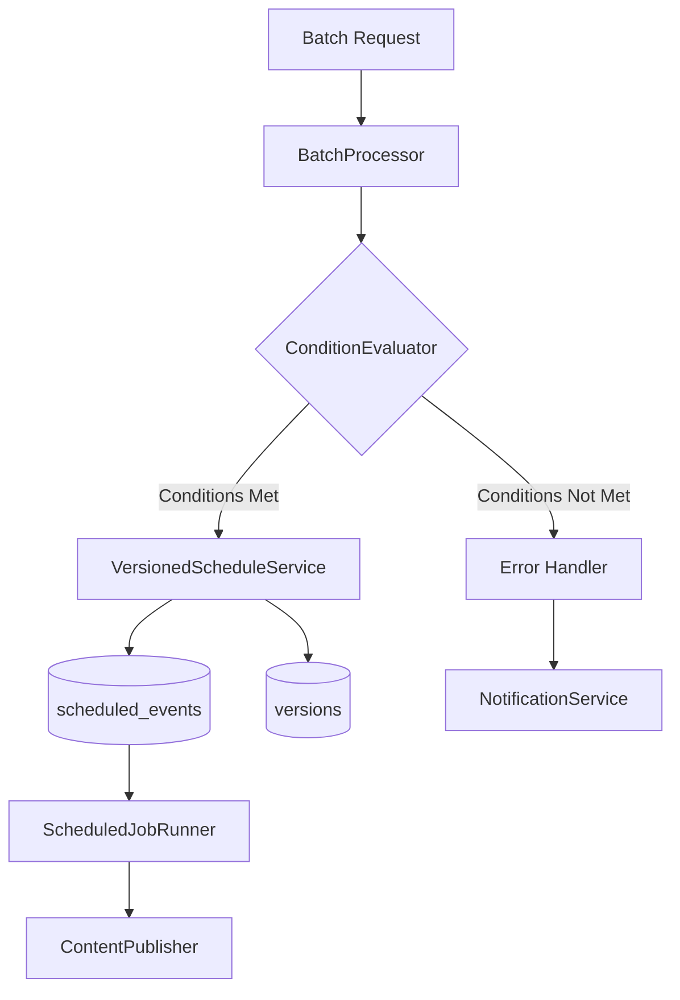

# Phase 3 Batch Processing Implementation Plan

## Architecture Overview

## Implementation Sequence
1. **Week 1: Enhance BatchScheduleController**
   - Add batch scheduling endpoint
   - Implement validation for bulk operations
   - Add permission checks for bulk scheduling

2. **Week 2: Build ConditionEvaluator**
   - Create interface with evaluate() method
   - Implement core conditions (time-based, dependency checks)
   - Add hook for custom conditions

3. **Week 3: VersionedScheduleService Integration**
   - Modify to handle bulk operations
   - Add batch conflict detection
   - Implement bulk version creation

4. **Week 4: Error Handling & Monitoring**
   - Create batch status tracking
   - Implement partial failure handling
   - Add progress reporting

## Risk Assessment
| Risk Level | Description | Mitigation Strategy |
|------------|-------------|---------------------|
| High | Shared hosting memory limits | Chunk processing (max 50 items/batch) |
| Medium | Version conflicts | Pre-check dependencies |
| Low | Permission escalation | Strict RBAC validation |

## Estimated Effort
- Core batch processor: 3 days
- Condition evaluator: 2 days
- Versioned scheduling: 3 days
- Error handling: 2 days
- Testing & optimization: 4 days
- **Total**: 14 developer days

## Constraints
- Pure PHP 8.1+ environment
- No CLI or background processes
- Follow existing project patterns