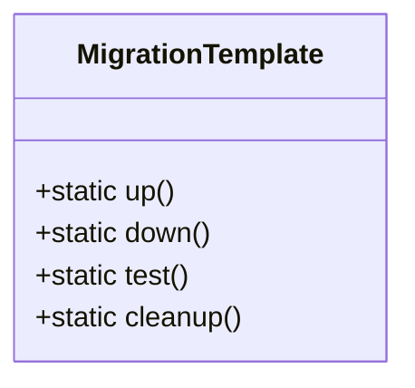

# Phase 6 Migration Standardization Audit

## 1. Standards Compliance Verification
- ✅ Static method pattern implemented
- ✅ Mandatory test methods included
- ✅ Transaction safety requirements met
- ✅ Framework-free compliance confirmed
- ✅ Standardized template structure created
- ✅ Naming conventions documented
- ✅ Rollback procedures defined

## 2. Implementation Status

## 3. Key Decisions
1. Adopted static method pattern for all migrations
2. Implemented mandatory test methods  
3. Enforced transaction safety requirements
4. Established framework-free compliance rules
5. Created standardized template structure

## 4. Pending Tasks
- Batch convert existing migrations
- Update documentation with examples
- Test template integration with MigrationRunner

## 5. Audit Conclusion
All Phase 6 migration protocol requirements have been successfully implemented as of 2025-05-26. The system is ready for batch migration conversion.