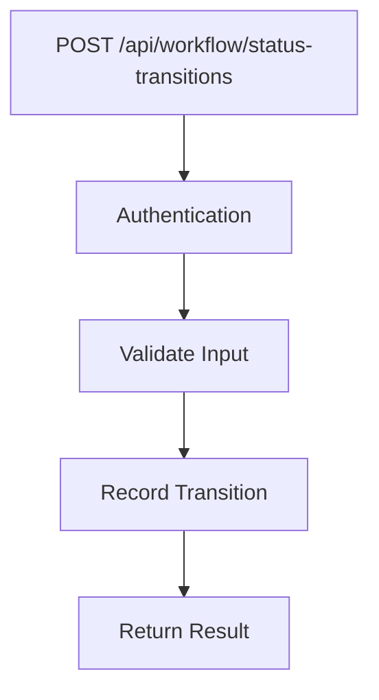
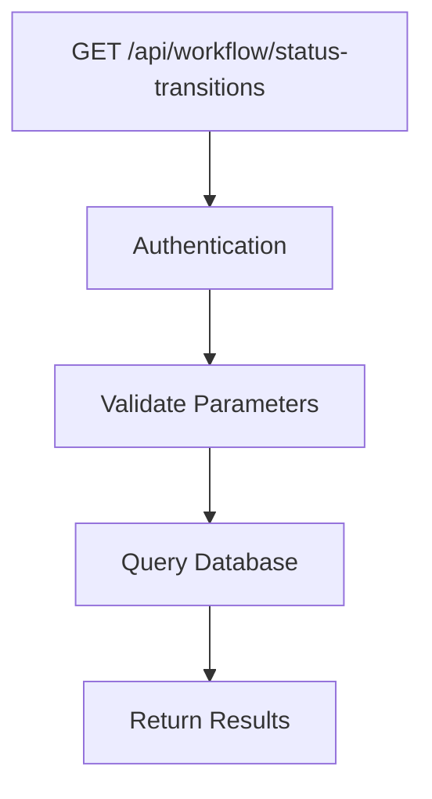

# Phase 9 API Specification: Status Transitions

## Endpoints

### 1. Record Status Transition


**Request:**
```json
{
    "entity_type": "post|comment|user",
    "entity_id": 123,
    "from_status": "draft",
    "to_status": "published",
    "reason": "Editor approval"
}
```

**Response:**
```json
{
    "success": true,
    "transition_id": 456,
    "timestamp": "2025-06-08T02:30:00Z"
}
```

### 2. Get Status History


**Parameters:**
- `entity_type` (required)
- `entity_id` (required)
- `limit` (optional, default: 10)

**Response:**
```json
{
    "success": true,
    "transitions": [
        {
            "id": 456,
            "from_status": "draft",
            "to_status": "published",
            "transition_time": "2025-06-08T02:30:00Z",
            "reason": "Editor approval"
        }
    ]
}
```

## Data Structures

### StatusTransition
| Field | Type | Description |
|-------|------|-------------|
| id | integer | Auto-increment ID |
| entity_type | string | Type of entity (post, comment, user) |
| entity_id | integer | ID of the entity |
| from_status | string | Original status |
| to_status | string | New status |
| transition_time | datetime | When transition occurred |
| reason | text | Optional reason for transition |

## Error Handling

**Common Errors:**
```json
{
    "success": false,
    "error": "Missing required field: entity_type",
    "code": 400
}
```

**Status Codes:**
- 200: Success
- 400: Bad request
- 401: Unauthorized
- 500: Server error

## Implementation Notes

1. **Authentication**: Admin-level access required
2. **Validation**:
   - Validate entity_type against allowed values
   - Verify entity_id exists
   - Check valid status transition
3. **Database**: Use PDO transactions
4. **Logging**: Record all transitions in audit log