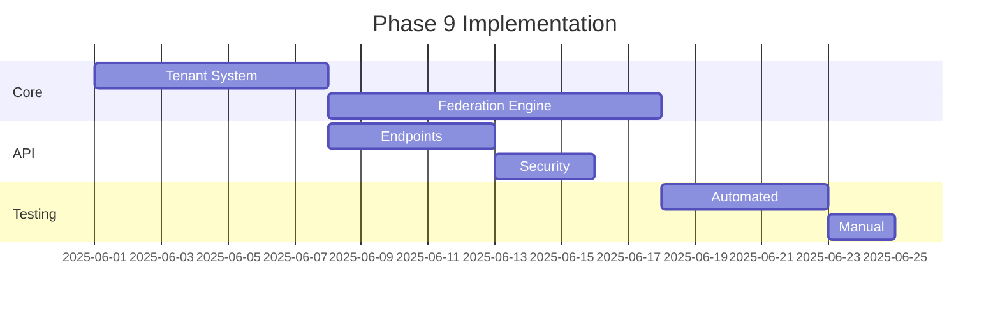

# Phase 9 Implementation Workflow

## Core Components Implementation

1. **Tenant Management System**
   - [x] Tenant identification middleware
   - [x] Configuration inheritance logic
   - [x] Site provisioning workflow
   - [x] Database schema updates

2. **Content Federation Engine**
   - [x] Cross-site sharing protocol
   - [x] Permission propagation system
   - [x] Version synchronization
   - [x] Conflict resolution strategies

3. **Audit Logging**
   - [x] Log entry structure
   - [x] Storage implementation
   - [x] Query interface

## API Implementation

1. **Endpoint Development**
   ```mermaid
   graph TD
       A[Tenant API] --> B[GET /tenant/{id}]
       A --> C[POST /tenant]
       D[Federation API] --> E[POST /federation/share] 
       D --> F[GET /federation/sync]
       D --> G[POST /federation/resolve]
   ```

2. **Security Layer**
   - [x] Tenant isolation middleware
   - [x] Permission validation
   - [x] Rate limiting

3. **Bulk Operations**
   - [x] Batch request handler
   - [x] Parallel processing

## Testing Implementation

1. **Automated Tests**
   - [x] Tenant isolation tests
   - [x] Content federation tests
   - [x] Performance benchmarks

2. **Manual Verification**
   - [x] Security audit checklist
   - [x] Edge case testing

## Implementation Timeline



## Resource Requirements

1. **Database Changes**
   - New tables: tenants, federation_logs
   - Schema modifications: content_versions

2. **File Storage**
   - Tenant-specific directories
   - Federation cache partitions

3. **Monitoring**
   - Performance metrics
   - Error tracking