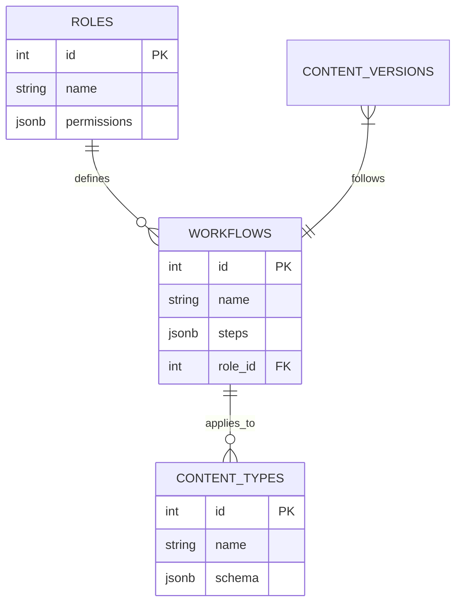
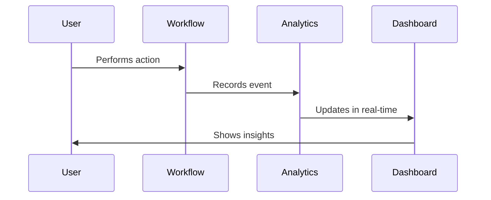
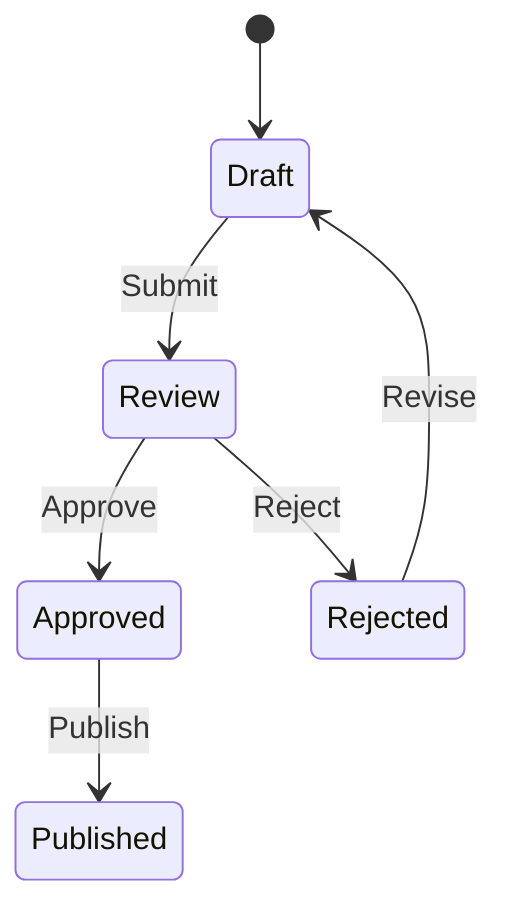

# Phase 23 Implementation Plan - Advanced Content Management

## 1. Role-Based Content Workflows

### Implementation Steps:
1. **Workflow Engine**
   - Create workflow definition system
   - Role-based step permissions
   - Content type associations

2. **Version Integration**
   - Automatic versioning at workflow steps
   - Approval tracking
   - Audit trails

3. **UI Integration**
   - Role-specific workflow views
   - Visual workflow editor
   - Status indicators

## 2. Enhanced Analytics Integration

### Implementation Steps:
1. **Workflow Analytics**
   - Step completion metrics
   - Bottleneck detection
   - Role performance tracking

2. **Content Insights**
   - Version comparison analytics
   - Approval cycle times
   - Content quality scoring

3. **Dashboard Enhancements**
   - Customizable widgets
   - Role-specific views
   - Export capabilities

## 3. Security & Compliance

### Implementation Steps:
1. **Access Controls**
   - Fine-grained content permissions
   - Workflow step restrictions
   - Audit logging

2. **Compliance Features**
   - Retention policy enforcement
   - Legal hold capabilities
   - Export for legal requests

3. **Security Monitoring**
   - Anomaly detection
   - Real-time alerts
   - Automated responses

## Implementation Timeline

| Week | Focus Area | Deliverables |
|------|------------|--------------|
| 1-2  | Workflow Engine | Core system, basic integrations |
| 3-4  | Analytics | Tracking, dashboards |
| 5-6  | Security | Access controls, monitoring |
| 7-8  | UI | Workflow editor, visualizations |

## Technical Specifications

1. **Database Requirements**
   - New workflow tables
   - Enhanced analytics tables
   - Audit log tables

2. **API Endpoints**
   - Workflow management
   - Analytics queries
   - Security controls

3. **Performance Considerations**
   - Workflow execution overhead
   - Analytics collection impact
   - Real-time updates scaling