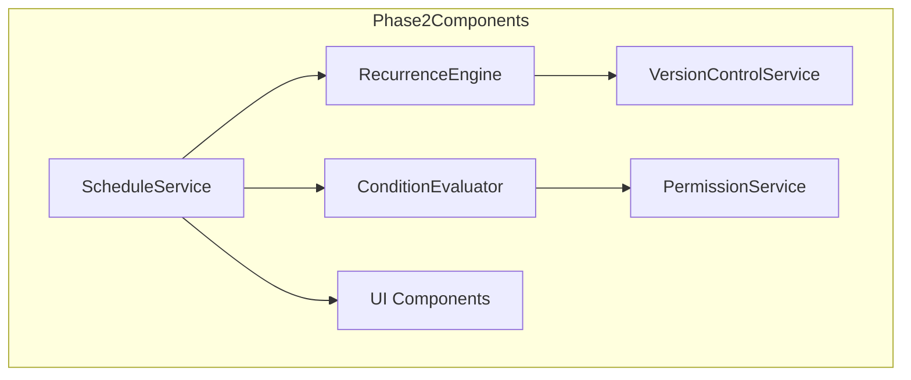

# Content Scheduling Phase 2 Implementation Plan

## Architecture Overview

## Implementation Tasks

### RecurrenceEngine (2 weeks)
1. Database changes:
   - Add recurrence_pattern column to scheduled_events
   - Add recurrence_metadata JSON column
   - Add next_occurrence column for performance

2. Service implementation:
   - CRON job for generating occurrences
   - Version tracking for each occurrence
   - Conflict detection for recurring events

3. API endpoints:
   - POST /api/schedules/recurring
   - GET /api/schedules/recurring/{id}/occurrences

### ConditionEvaluator (1.5 weeks)
1. Database changes:
   - Add conditions JSON column to scheduled_events
   - Add evaluation_log table

2. Service implementation:
   - Pre-publish condition checking
   - Post-publish validation
   - Permission-aware condition evaluation

3. API endpoints:
   - POST /api/schedules/conditional
   - GET /api/schedules/{id}/evaluation

### UI Updates (0.5 weeks)
1. New components:
   - Recurrence pattern editor
   - Condition builder
   - Version timeline visualization

## Dependencies

1. VersionControlService must be operational
2. RBAC permissions must be configured
3. Database migrations from Phase 1 must be applied

## Constraints

1. Shared hosting compatibility
2. No CLI tools (must use web-based CRON)
3. PHP 8.1+ features only
4. Must maintain backward compatibility

## Risk Mitigation

1. Feature flags for gradual rollout
2. Comprehensive version tracking
3. Automated conflict detection
4. Detailed logging for debugging