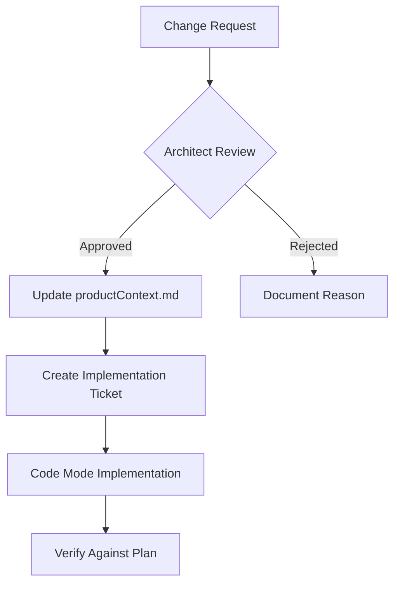

# Plan Governance System

## 1. Single Source of Truth
- `productContext.md` is the authoritative plan document
- All other plans are historical references only
- Changes must flow through governance process

## 2. Change Control Process

## 3. Implementation Safeguards
- Weekly architecture reviews
- Automated checks against `productContext.md`
- Phase completion checklists
- Document all deviations with reasons

## 4. Version Control
- Git-track changes to `productContext.md`
- Tag versions with phase milestones
- Maintain changelog of modifications

## 5. Enforcement Mechanisms
- Pre-commit hooks validate changes
- CI/CD checks plan compliance
- Automated alerts for deviations