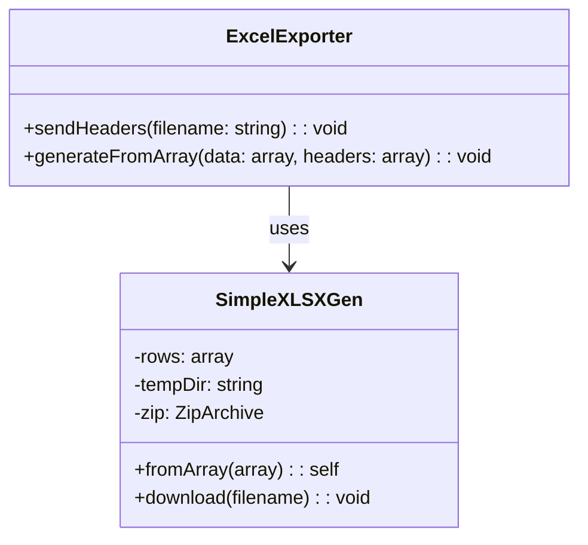

# Reporting Features Documentation

## Excel Export Functionality

### Core Components
- [`ExcelExporter.php`](admin/reports/ExcelExporter.php): Public interface for generating Excel reports
- [`SimpleXLSXGen.php`](admin/reports/SimpleXLSXGen.php): Internal XLSX generator implementation

### Class Diagram


### Usage Example
```php
$exporter = new ExcelExporter();
$data = [
    ['ID', 'Name', 'Value'],
    [1, 'Item 1', 100],
    [2, 'Item 2', 200]
];
$exporter->generateFromArray($data, 'report.xlsx');
```

### Technical Specifications
- Format: XLSX (Office Open XML)
- Dependencies: PHP Zip extension
- Memory Usage: Temporary files used for generation
- Security: 
  - Input sanitization via htmlspecialchars()
  - Temporary files cleaned after download

### Limitations
- Single worksheet per file
- Basic formatting only
- No formula support
- Maximum ~65,000 rows

### Future Enhancements
- Multiple worksheet support
- Cell formatting options
- Formula support
- Streaming for large datasets