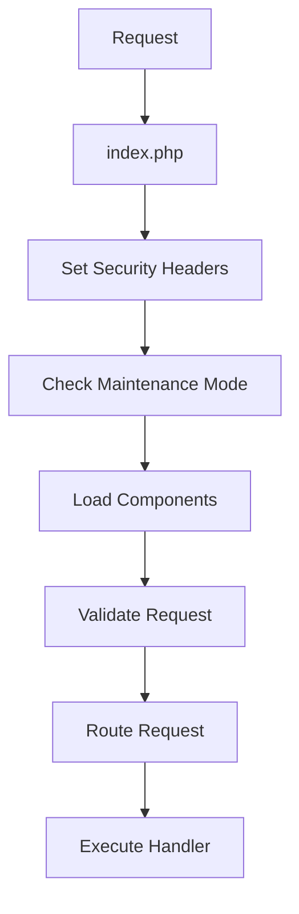

# CMS Routing Flow Documentation

## Overview
The CMS now uses a dedicated routing system with middleware validation and caching. The flow is as follows:

1. Request enters `index.php`
2. Security headers are set
3. Maintenance mode is checked
4. Required components are loaded
5. Request is validated by middleware
6. Route is dispatched by Router

## Components

### Router (`includes/Router.php`)
- Singleton pattern ensures single instance
- Handles route registration and dispatching
- Supports HTTP methods: GET, POST, PUT, DELETE, PATCH, OPTIONS
- Implements route caching via Cache class

Key Methods:
- `addRoute()` - Register a new route
- `loadRoutes()` - Load routes from cache or initialize defaults
- `cacheRoutes()` - Cache current routes
- `dispatch()` - Match and execute route handler

### Validation Middleware (`includes/middleware/ValidationMiddleware.php`)
- Validates request before routing
- Checks:
  - Valid HTTP method
  - Safe request path
  - No path traversal attempts

## Flow Details

## Cache Behavior
- Routes are cached for 1 hour (3600 seconds)
- Cache key: 'cached_routes'
- Cache is invalidated when new routes are added

## Error Handling
- 400 Bad Request for invalid paths
- 405 Method Not Allowed for invalid HTTP methods
- 404 Not Found for unmatched routes