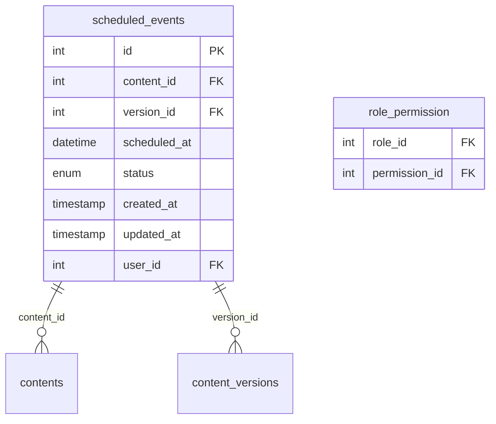

# Phase 11 Task 8 Implementation Plan: Content Scheduling System

## Database Schema (Verified)

## Required API Endpoints
1. `POST /scheduling/create` - Create new scheduled event
   - Requires: `schedule_content` permission
   - Parameters: content_id, version_id, scheduled_at

2. `GET /scheduling/list` - List scheduled events
   - Requires: `view_scheduled_content` permission
   - Parameters: filters (status, date range)

3. `PUT /scheduling/{id}` - Update scheduled event
   - Requires: `schedule_content` permission
   - Parameters: scheduled_at, status

4. `DELETE /scheduling/{id}` - Cancel scheduled event
   - Requires: `schedule_content` permission

## Service Layer Components
1. `SchedulingService` with methods:
   - `createScheduledEvent()`
   - `getScheduledEvents()`
   - `updateScheduledEvent()`
   - `cancelScheduledEvent()`
   - `processDueEvents()` (for cron job)

2. Integration with:
   - ContentService (for version validation)
   - PermissionService (for access control)
   - NotificationService (for status updates)

## Test Coverage Requirements
1. Unit Tests:
   - SchedulingService methods
   - Permission validation
   - Content version validation

2. Integration Tests:
   - API endpoint responses
   - Database operations
   - Permission enforcement

3. System Tests:
   - End-to-end scheduling workflow
   - Cron job execution
   - Error handling

## Implementation Steps
1. Create SchedulingController with API endpoints
2. Implement SchedulingService with transaction handling
3. Add permission checks to all endpoints
4. Create database migration for any additional indexes
5. Implement cron job for processing due events
6. Write comprehensive test suite