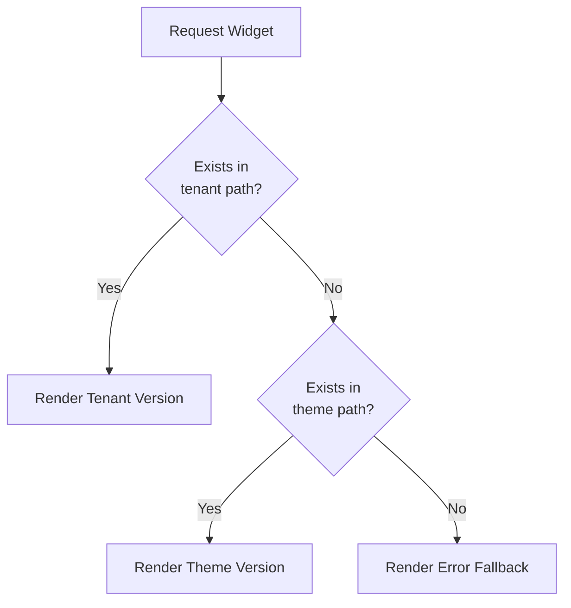

# Theme Widget Rendering System

## 1. Implementation Overview
The widget rendering system provides dynamic content blocks that can be placed in themes. Key components:
- Widget templates stored in `/admin/themes/[theme_name]/widgets/`
- Central WidgetRenderer class handles loading and rendering
- Tenant-specific overrides supported via `/admin/tenant/[tenant_id]/widgets/`

## 2. Tenant-Specific Widget Loading Process
1. System checks for tenant-specific widget first:
   - `/admin/tenant/[tenant_id]/widgets/[widget_name].php`
2. Falls back to theme default if not found:
   - `/admin/themes/[theme_name]/widgets/[widget_name].php`
3. Final fallback to system error template:
   - `/admin/themes/default/widgets/error_fallback.php`

## 3. Fallback Handling Workflow


## 4. Error Handling Procedures
- Missing widgets trigger error_fallback.php
- Template errors logged to `/admin/logs/widget_errors.log`
- Fallback template receives:
  - `$_widget_name`: Requested widget name
  - `$_theme`: Current theme name
  - `$_tenant`: Current tenant ID (if any)

## 5. Usage Examples
```php
// Basic widget rendering
echo WidgetRenderer::render('text_block', $content_data);

// With tenant context
echo WidgetRenderer::forTenant($tenant_id)->render('promo_banner', $banner_data);
```

## 6. Test Case References
See [widget_test_cases.md](./widget_test_cases.md):
- Basic rendering: Test Case 1
- Fallback behavior: Test Case 2  
- Tenant overrides: Test Case 3