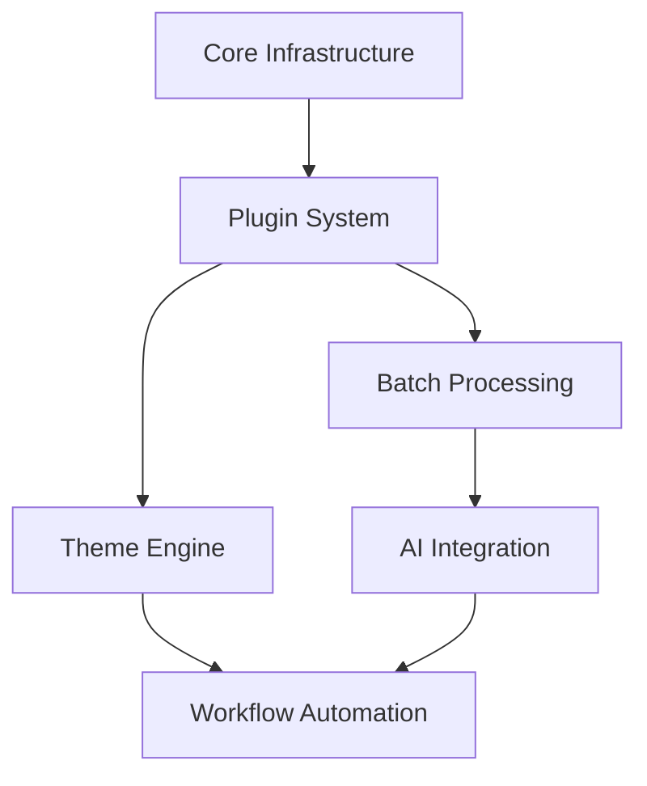

# Unified CMS Development Roadmap

## Phase 1-2: Core Infrastructure
- Database schema (MySQL compatible)
- Authentication system (PHP sessions)
- Basic content management (CRUD operations)
- File-based routing system
- Shared hosting optimizations

## Phase 3: Plugin System (Current Priority)
- Hook architecture (action/filter system)
- Plugin sandboxing (security isolation)
- Dependency management
- Plugin marketplace foundations
- Automatic updates via REST API

## Phase 4: Theme Engine
- Template inheritance system
- Asset pipeline (CSS/JS compilation)
- Theme marketplace integration
- Live preview functionality
- Child theme support

## Phase 5: Batch Processing
- Queue system (file-based)
- Background workers (cron-based)
- Job prioritization
- Progress tracking UI
- Failure recovery system

## Phase 6: AI Integration
- OpenAI API wrapper
- Content generation endpoints
- Image processing (DALL-E integration)
- Moderation filters
- AI-assisted content editing

## Phase 7: Workflow Automation
- n8n REST API integration
- Custom trigger system
- Action templates
- Audit logging
- Visual workflow builder

## Dependencies

## Risk Assessment
1. **Plugin Security**: Sandboxing critical to prevent exploits
2. **Batch Processing**: Shared hosting cron limitations
3. **AI Costs**: API usage monitoring required
4. **Theme Conflicts**: Need strict versioning
5. **Workflow Complexity**: User education needed

## Timeline
| Phase | Estimated Duration |
|-------|-------------------|
| 1-2   | 4 weeks (completed) |
| 3     | 6 weeks           |
| 4     | 5 weeks           |
| 5     | 4 weeks           |
| 6     | 3 weeks           |
| 7     | 4 weeks           |