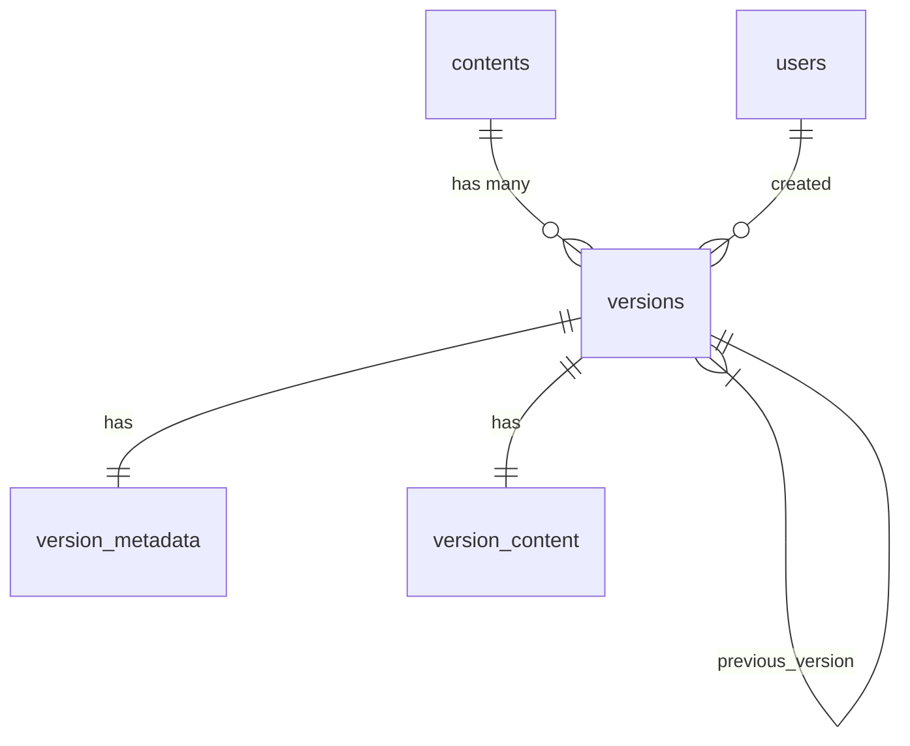

# Version Control Database Schema Documentation

## Tables Overview

1. **versions** - Tracks version numbers and basic metadata
   - Relates to contents table via content_id
   - Relates to users table via created_by
   - Contains is_autosave flag for draft versions

2. **version_metadata** - Additional version tracking info
   - Relates to versions table via version_id
   - Tracks change type and summary
   - References previous_version_id for version lineage

3. **version_content** - Stores actual content snapshots
   - Relates to versions table via version_id
   - Contains full content data for each version

## Relationships

## Key Features

- Full version history tracking with content snapshots
- Support for both manual versions and autosaves
- Clear lineage between versions
- Audit trail of changes via metadata
- Efficient storage with relational integrity