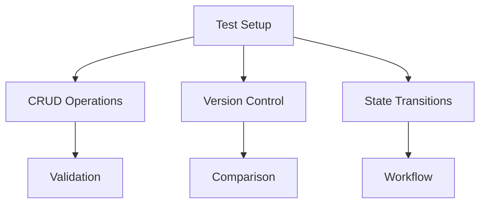
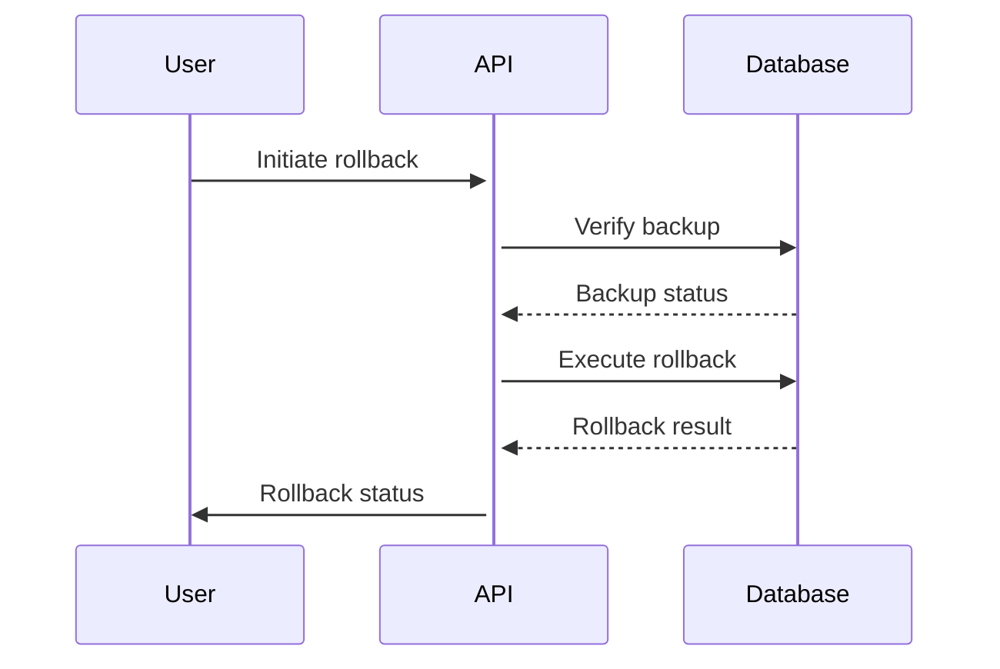

# Phase 10 Implementation Plan

## 1. Core Objectives
- Complete content management testing suite
- Ensure framework compliance (pure PHP 8.1+)
- Finalize database migration safety
- Update documentation

## 2. Testing Implementation
### Content Management Tests

### Test Cases
1. **CRUD Operations**
   - Field validation
   - Status code verification
   - Large content handling (10MB+)

2. **Version Control**  
   - Diff analysis
   - Rollback integrity
   - Concurrent versioning

3. **State Transitions**
   - Valid/invalid paths
   - Concurrency handling
   - Audit logging

## 3. Framework Compliance
### Laravel Pattern Removal
- Audit remaining Laravel dependencies
- Replace with pure PHP implementations:
  - Static method conversions
  - Custom query builder
  - Simplified routing

### Compliance Checklist
- [ ] No framework references
- [ ] Static methods only
- [ ] Web-accessible endpoints
- [ ] FTP-deployable structure

## 4. Database Migration Safety
### Rollback Procedures

### Safety Measures
- Pre-rollback verification
- Data integrity checks
- Web-based rollback endpoints

## 5. Documentation Updates
### Required Updates
- Phase completion report
- Test case documentation
- Migration safety procedures
- Framework compliance guide

## 6. Implementation Timeline
| Week | Focus Area | Deliverables |
|------|------------|--------------|
| 1 | Content Testing | CRUD test suite |
| 2 | Framework Compliance | Laravel removal |
| 3 | Migration Safety | Rollback tests |
| 4 | Documentation | Final reports |

## 7. Risk Mitigation
- **Testing Gaps**: Additional validation cases
- **Framework Issues**: Fallback implementations
- **Migration Risks**: Enhanced verification
- **Documentation**: Peer reviews