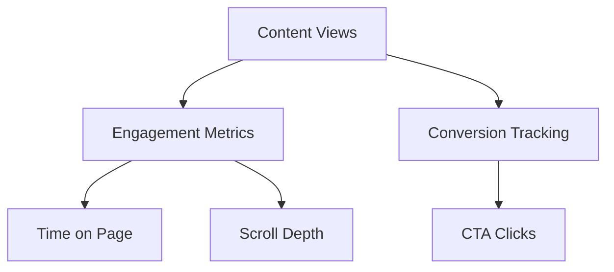

# Phase 11 Implementation Plan

## 1. Core Objectives
- Implement analytics dashboard for content performance
- Enhance content lifecycle management
- Improve version control system
- Maintain framework-free PHP compliance

## 2. Analytics Implementation
### Dashboard Components

### Data Collection
1. **View Tracking**
   - Page view logging
   - Unique visitor identification
   - Referrer tracking

2. **Engagement Metrics**
   - Time spent calculations
   - Scroll depth monitoring
   - Interaction tracking

3. **Storage Strategy**
   - Daily aggregates
   - Raw data retention policy
   - Privacy compliance

## 3. Content Lifecycle Enhancements
### Workflow Improvements
- Automated archival based on metrics
- Content refresh reminders
- Performance-based recommendations

### Version Control Upgrades
- Enhanced diff visualization
- Change impact scoring
- Multi-user collaboration features

## 4. Framework Compliance
- Verify no framework dependencies
- Static method validation
- Web-accessible endpoints check

## 5. Implementation Timeline
| Week | Focus Area | Deliverables |
|------|------------|--------------|
| 1 | Analytics Core | Tracking implementation |
| 2 | Dashboard UI | Visualization components |
| 3 | Lifecycle Automation | Workflow rules engine |
| 4 | Version Control | Enhanced diff tools |
| 5 | Testing & Docs | Final verification |

## 6. Risk Mitigation
- **Data Volume**: Implement aggregation strategy
- **Performance**: Optimize query patterns
- **Privacy**: Anonymization procedures
- **Compliance**: Regular architecture reviews