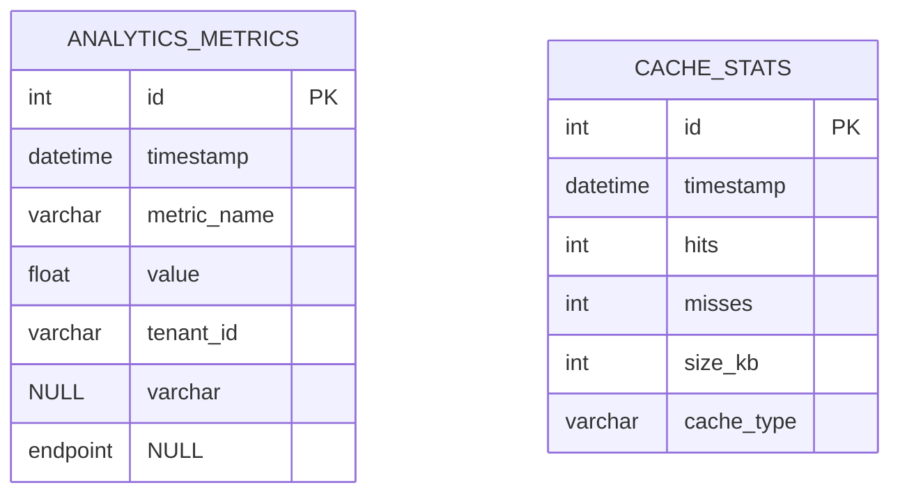

# Phase 12: Analytics & Performance Optimization

## 1. Current State
- AnalyticsService core implemented
- Phase10 database tables operational
- Basic reporting functionality available

## 2. Optimization Goals
### Performance Metrics
- Track response times per endpoint
- Monitor memory usage trends
- Record query execution times
- Tenant-specific performance baselines

### Cache Monitoring
- Track cache hit/miss ratios
- Monitor cache size growth
- Identify inefficient cache patterns
- Tenant-aware cache statistics

### Data Retention
- Implement tiered retention policies:
  - 30 days - high resolution
  - 90 days - hourly aggregates
  - 1 year - daily aggregates
- Automated cleanup procedures

## 3. Implementation Plan
### Database Changes

### Service Layer
1. Extend AnalyticsService with:
   - `trackPerformance()` method
   - `monitorCache()` integration
   - `applyRetentionPolicies()`

2. Create new PerformanceMonitor service:
   - Lightweight instrumentation
   - Minimal overhead
   - Tenant isolation

### UI Components
1. Performance dashboard:
   - Response time trends
   - Memory usage charts
   - Query performance

2. Cache visualization:
   - Hit/miss ratios
   - Size monitoring
   - Type breakdown

## 4. Integration Points
- DashboardService
- CacheManager
- QueryOptimizer
- TenantIsolation middleware

## 5. Testing Requirements
- Web-accessible test endpoints
- Tenant isolation verification
- Performance impact monitoring
- Retention policy validation

## 6. Constraints
- Shared hosting compatible
- No CLI dependencies
- FTP-deployable
- PHP 8.1+ only