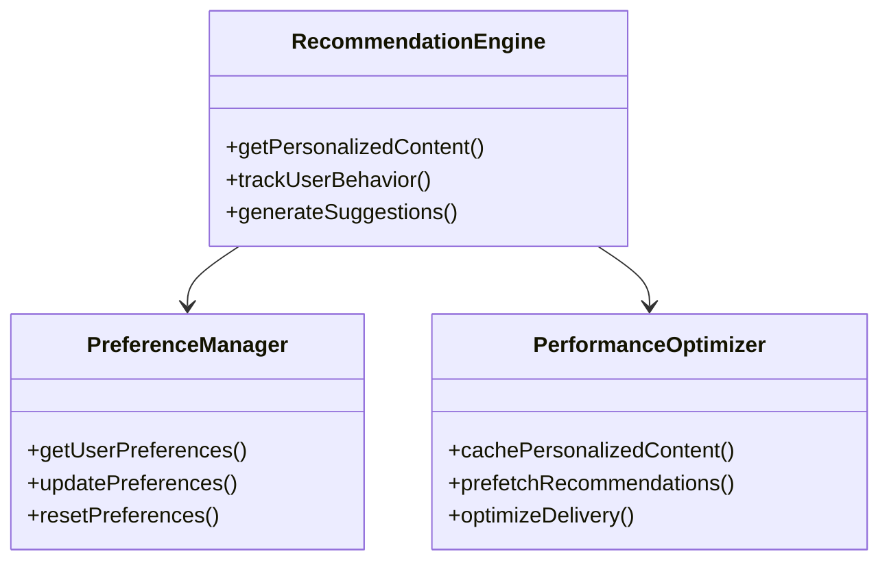
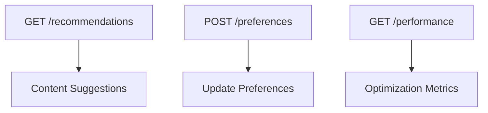

# Phase 12: Content Personalization Engine

## Core Objectives
1. Implement content recommendation system
2. Develop user preference tracking
3. Optimize performance for personalized content delivery
4. Maintain framework-free PHP implementation

## Architecture Components

## Implementation Plan

### 1. Recommendation Engine
- Content similarity analysis
- Collaborative filtering
- Hybrid recommendation strategies
- A/B testing framework

### 2. Preference Management
- Anonymous preference tracking
- Registered user profiles
- Preference inheritance
- Opt-out mechanisms

### 3. Performance Optimization
- Personalized content caching
- Recommendation pre-fetching
- Delivery optimization
- Resource monitoring

## API Endpoints

## Testing Strategy
- Unit tests for core algorithms
- Integration tests for API endpoints
- Performance benchmarks
- User experience testing

## Migration Considerations
- Backward compatibility
- Data migration scripts
- Fallback mechanisms
- Monitoring integration