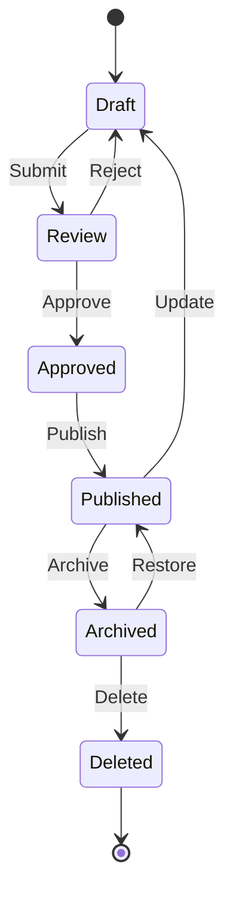

# Phase 5: Content Lifecycle Implementation

## Objectives
Implement comprehensive content state management and lifecycle transitions

## Duration
3 weeks (2025-06-02 to 2025-06-23)

## Dependencies
- Phase 4 (Workflow Triggers) completion

## Tasks
1. **Core State Engine**
   - Define content states (Draft, Review, Approved, Published, Archived, Deleted)
   - Implement state transition validation rules
   - Create database schema for state tracking

2. **Admin Interface**
   - Develop state management UI
   - Create transition approval workflows
   - Build state history viewer

3. **Automated Transitions**
   - Implement time-based publishing/archiving
   - Create event-based state changes
   - Develop content expiration system

4. **Reporting & Analytics**
   - Build lifecycle metrics dashboard
   - Create state transition reports
   - Implement audit logging

## Database Schema Changes
```sql
-- Content States Table
CREATE TABLE content_states (
    id INT AUTO_INCREMENT PRIMARY KEY,
    name VARCHAR(50) NOT NULL,
    description TEXT,
    is_system TINYINT(1) DEFAULT 0
);

-- State Transitions Table  
CREATE TABLE content_state_transitions (
    id INT AUTO_INCREMENT PRIMARY KEY,
    from_state_id INT,
    to_state_id INT NOT NULL,
    permission_required VARCHAR(100),
    FOREIGN KEY (from_state_id) REFERENCES content_states(id),
    FOREIGN KEY (to_state_id) REFERENCES content_states(id)
);

-- State History Table
CREATE TABLE content_state_history (
    id INT AUTO_INCREMENT PRIMARY KEY,
    content_id INT NOT NULL,
    from_state_id INT,
    to_state_id INT NOT NULL,
    changed_by INT NOT NULL,
    changed_at DATETIME DEFAULT CURRENT_TIMESTAMP,
    notes TEXT,
    FOREIGN KEY (from_state_id) REFERENCES content_states(id),
    FOREIGN KEY (to_state_id) REFERENCES content_states(id)
);
```

## State Transition Diagram


## Implementation Timeline
- Week 1: Core state engine and database changes
- Week 2: Admin interface and transition logic  
- Week 3: Automated transitions and reporting

## Success Metrics
- 100% content items with state tracking
- All state transitions logged and auditable
- Admin interface fully functional
- Automated transitions working