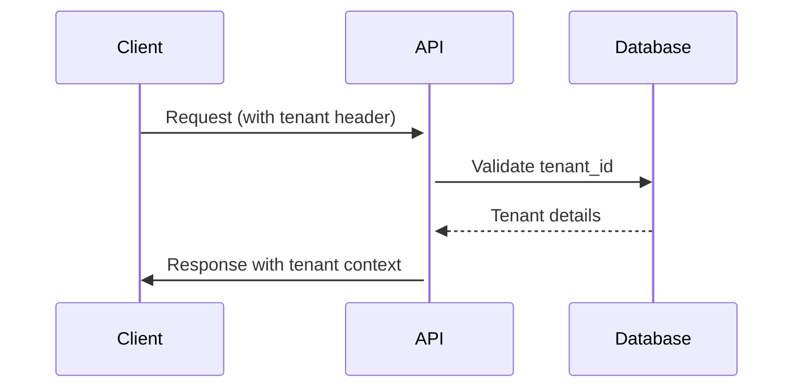
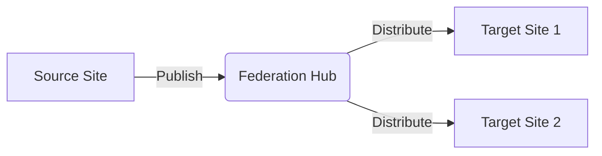

# Phase 9: Content Federation Core Engine

## Site Management
### Tenant Identification


### Site Provisioning Workflow
1. Create tenant record in `tenants` table
2. Generate default configuration
3. Set up storage directories
4. Initialize default content

### Configuration Inheritance
```php
// Example configuration hierarchy
$config = array_merge(
    $globalConfig,       // System defaults
    $tenantConfig,       // Tenant-specific overrides
    $siteConfig          // Individual site customizations
);
```

## Content Federation
### Cross-Site Sharing Protocol


### Permission Propagation
- Source site permissions mapped to target sites
- Permission translation rules
- Override capabilities for target admins

### Version Synchronization
1. Content changes generate version hashes
2. Federation requests include version metadata
3. Conflict resolution strategies:
   - Last-write-wins (timestamp)
   - Manual merge
   - Version branching

## Audit Logging
```php
// Audit log entry example
$auditLog = [
    'action' => 'content_federation',
    'source_tenant' => 'tenant-a',
    'target_tenant' => 'tenant-b',
    'content_id' => 'abc123',
    'timestamp' => time(),
    'user_id' => 'user-456'
];
```

## Performance Optimization
### Caching Strategy
- Tenant-specific cache partitions
- Federation metadata cache
- Cache invalidation triggers

### Query Optimization
- Tenant-aware query builder
- Prepared statements with tenant context
- Explain plan analysis

## Implementation Classes
```mermaid
classDiagram
    class TenantManager {
        +getCurrentTenant()
        +validateTenant()
        +getTenantConfig()
    }
    
    class ContentFederator {
        +shareContent()
        +syncVersions()
        +resolveConflicts()
    }
    
    TenantManager --> ContentFederator