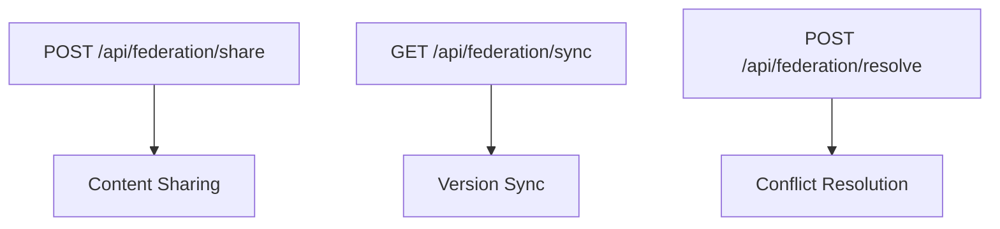

# Phase 9: API Integration for Content Federation

## Core API Endpoints

### Tenant Identification
```http
GET /api/tenant/{tenant_id}
Headers:
  X-Tenant-Context: {tenant_hash}
```

### Content Federation Endpoints


## Security Implementation

### Tenant Isolation Middleware
```php
// Example middleware implementation
function tenantIsolation($request) {
    $tenantId = $request->header('X-Tenant-Context');
    if (!validateTenant($tenantId)) {
        return errorResponse('Invalid tenant context', 403);
    }
    setCurrentTenant($tenantId);
}
```

### Permission Validation
- Role-based access control matrix
- Content ownership verification
- Cross-tenant permission mapping

## Error Handling Standards

### Error Response Format
```json
{
  "error": {
    "code": "TENANT_VIOLATION",
    "message": "Invalid tenant context",
    "tenant_id": "tenant-a",
    "timestamp": "2025-05-29T03:35:46Z",
    "details": {
      "required_scope": "content:write",
      "current_scope": "content:read"
    }
  }
}
```

## Rate Limiting Strategy

```mermaid
gantt
    title Rate Limit Buckets
    dateFormat  HH:mm
    section Global
    System-wide :a1, 00:00, 60s
    section Per-Tenant
    Tenant-A :a2, 00:00, 10s
    Tenant-B :a3, 00:00, 10s
```


## Bulk Operations API

### Batch Request Format
```json
{
  "operations": [
    {
      "method": "POST",
      "path": "/api/content",
      "body": {"title": "Shared Content"}
    },
    {
      "method": "PUT",
      "path": "/api/federation/sync",
      "params": {"version": "1.2.3"}
    }
  ]
}
```

## API Versioning
- Header-based version negotiation (`Accept-Version: 1.1`)
- Deprecation policy timeline
- Version migration guides

## Testing Endpoints
```php
// Example test endpoint
if ($_GET['test'] === 'tenant-isolation') {
    header('Content-Type: application/json');
    echo json_encode([
        'current_tenant' => getCurrentTenant(),
        'is_valid' => validateTenant(getCurrentTenant())
    ]);
    exit;
}