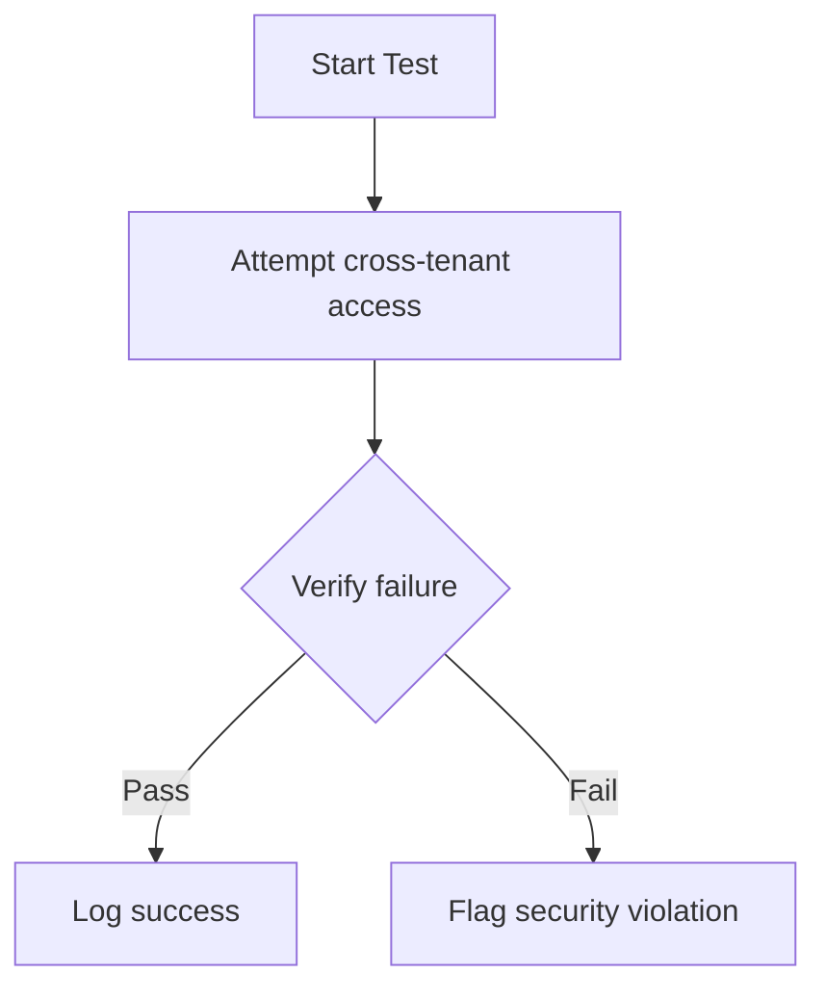
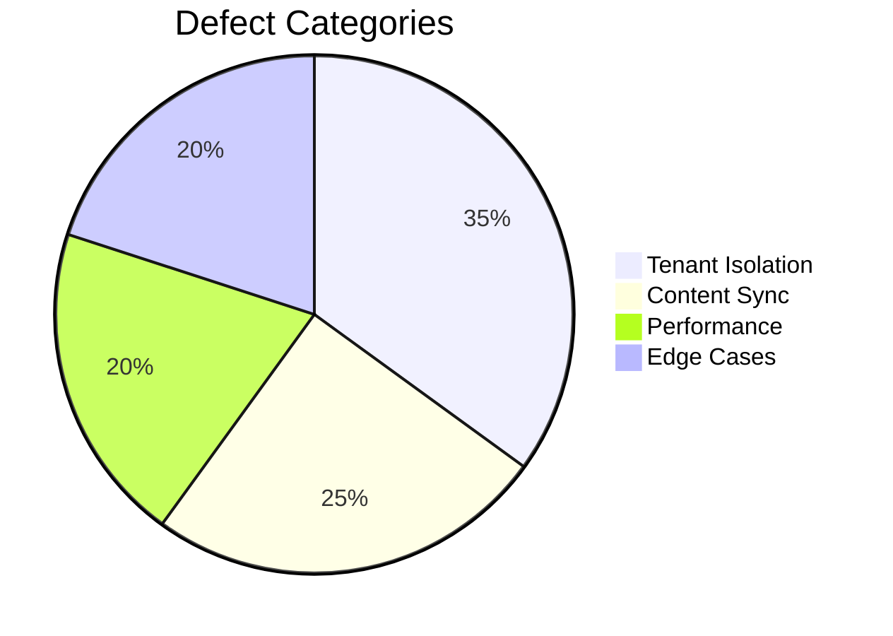

# Phase 9: Content Federation Testing Suite

## Core Test Categories

### Tenant Isolation Tests


### Content Federation Tests
```php
// Example test case
function testContentFederation() {
    $sourceContent = createTestContent('tenant-a');
    $result = federateContent($sourceContent, 'tenant-b');
    assertNotNull($result['federation_id']);
    assertEqual($result['status'], 'success');
}
```

## Status Transition Tests

### Tenant-Aware Transition Validation
```php
function testValidSameTenantTransition() {
    $content = createTestContent('tenant-a');
    $result = StatusTransitionHandler::applyTransition(
        $content['id'],
        $content['status_id'],
        Status::PUBLISHED
    );
    assertTrue($result);
    assertEqual(getContentStatus($content['id']), Status::PUBLISHED);
}

function testInvalidCrossTenantTransition() {
    $content = createTestContent('tenant-a');
    switchTenantContext('tenant-b');
    $result = StatusTransitionHandler::applyTransition(
        $content['id'],
        $content['status_id'],
        Status::PUBLISHED
    );
    assertFalse($result);
    assertEqual(getContentStatus($content['id']), $content['status_id']);
}

function testTransitionLogsTenantContext() {
    $content = createTestContent('tenant-a');
    StatusTransitionHandler::applyTransition(
        $content['id'],
        $content['status_id'],
        Status::PUBLISHED
    );
    $log = getLastTransitionLog($content['id']);
    assertEqual($log['tenant_id'], 'tenant-a');
}

## Automated Test Framework

### Test Sequence Structure

```mermaid
gantt
    title Test Execution Timeline
    dateFormat  HH:mm:ss
    section Isolation
    Tenant Boundary :a1, 00:00:00, 10s
    Permission Check :a2, after a1, 15s
    section Federation
    Content Share :a3, after a2, 20s
    Version Sync :a4, after a3, 25s
```


### Performance Benchmarks
| Test Case | Threshold | Unit |
|-----------|-----------|------|
| Content Share | < 500ms | per MB |
| Version Sync | < 200ms | per 100 versions |
| Bulk Operations | < 2s | per 100 items |

## Manual Verification

### Security Audit Checklist
1. [ ] Verify tenant cookie isolation
2. [ ] Test session crossover prevention
3. [ ] Validate permission propagation
4. [ ] Confirm audit logging

### Edge Case Testing
- Concurrent content modifications
- Network interruption during sync
- Malformed federation requests
- Maximum payload size handling

## Reporting Standards

### Test Result Format
```json
{
  "test_id": "fed-001",
  "timestamp": "2025-05-29T03:36:40Z",
  "status": "passed",
  "metrics": {
    "duration_ms": 245,
    "memory_mb": 12.3
  },
  "artifacts": [
    "/logs/fed-001-details.log"
  ]
}
```

### Regression Tracking


## Test Environment Setup
```php
// Test bootstrap example
function setupTestEnvironment() {
    createTestTenant('tenant-a');
    createTestTenant('tenant-b');
    configureContentTypes();
    seedTestData();
}