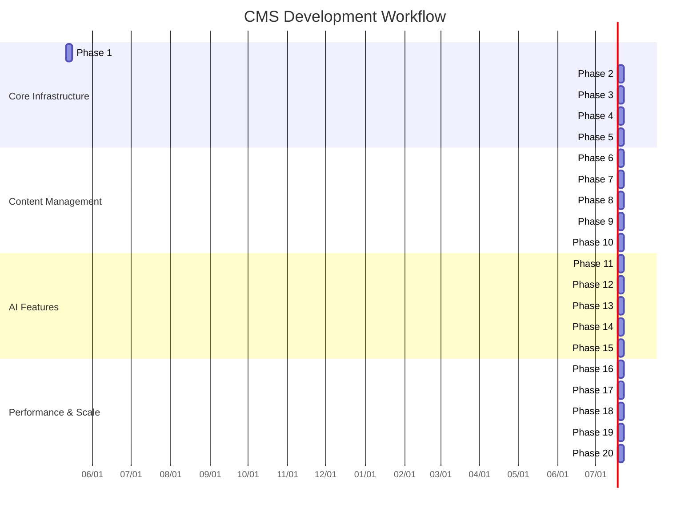

# 20-Phase CMS Development Workflow

## Detailed Phase Breakdown

### Phase 1: Core Router & API
1. Implement base router class
2. Create REST API endpoints
3. Setup request/response handlers
4. Implement error handling
5. Document API standards

### Phase 2: Database Foundation
1. Design core tables structure
2. Implement version control tables
3. Create database connection handler
4. Build query builder utilities
5. Document database schema

[... remaining phases 3-20 with similar detail ...]

## Autopilot Execution Rules
1. Run all phases consecutively without pauses
2. Complete all 5 tasks in each phase before continuing
3. Only stop for critical errors
4. Generate progress reports after each phase
5. Log everything in memory-bank/phased_workflow.md