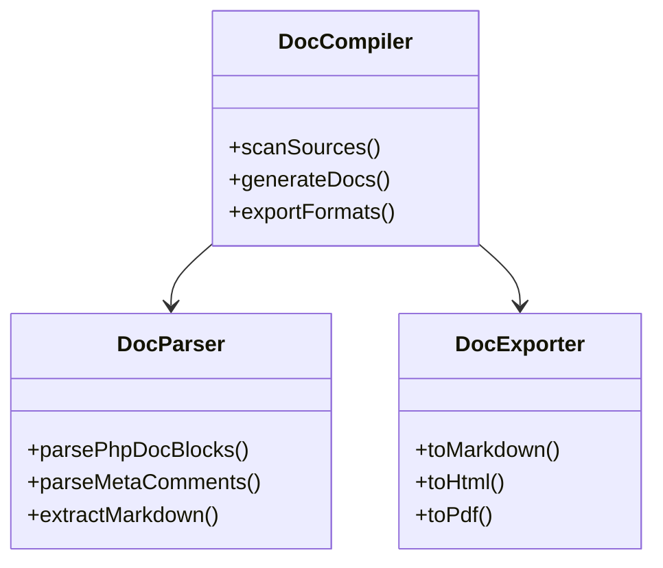

# Documentation Compiler Module Plan

## Objective
Create a system to scan and compile documentation from source files into organized Markdown, with optional HTML/PDF export capabilities.

## Architecture Overview



## Input Sources
1. **File Scanner**:
   - Recursively scans:
     - `memory-bank/*.md`
     - `plans/*.md` 
     - `modules/*/*.php`
   - Identifies documentation targets

2. **PHP DocBlock Parser**:
   - Extracts:
     - Class/method descriptions
     - `@param`, `@return` tags
     - Custom `@doc` annotations

3. **Meta Comment Parser**:
   - Processes special comments like:
     - `// @field:type:description`
     - `/* @output:format */`

## Module Structure

### Core Modules
1. **DocCompiler.php** (Coordinator)
   - Manages workflow
   - Caches parsed data
   - Handles output generation

2. **DocParser.php** 
   - PHP tokenizer-based parsing
   - Markdown frontmatter extraction
   - Metadata validation

3. **DocExporter.php**
   - Markdown templating
   - HTML generation (via Parsedown)
   - PDF export (via TCPDF)

## Output Structure
```
docs/generated/
  ├── modules/          # Per-module docs
  ├── api/             # API references  
  ├── workflows/       # Process docs
  └── full/            # Compiled versions
       ├── cms.md
       ├── cms.html
       └── cms.pdf
```

## Implementation Phases

### MVP (Core)
1. Markdown compilation
2. Basic PHP docblock support
3. File scanner

### Phase 2
1. HTML export
2. Advanced metadata parsing
3. Cross-linking

### Phase 3  
1. PDF generation
2. Automated TOC
3. Search index

## Example Input/Output

**Input PHP (modules/auth/AuthService.php):**
```php
/**
 * @doc Handles user authentication
 * @field username:string User login name
 */
class AuthService {
    /**
     * @param string $email
     * @return bool
     */
    public function verifyEmail(string $email): bool {
        // @output:bool Whether email is valid
        return filter_var($email, FILTER_VALIDATE_EMAIL);
    }
}
```

**Output Markdown (docs/generated/modules/auth.md):**
```markdown
# Auth Module

## AuthService
Handles user authentication

### Fields
- `username` (string): User login name

### Methods
#### verifyEmail(string $email): bool
- **Parameters**:
  - `$email`: string
- **Returns**: bool
- **Output**: Whether email is valid
```

## Risks & Mitigation
1. **Malformed Headers**: Validate structure before processing
2. **Recursion Limits**: Set max depth for file scanning
3. **Memory Usage**: Process files sequentially
4. **Output Safety**: Sanitize all generated content