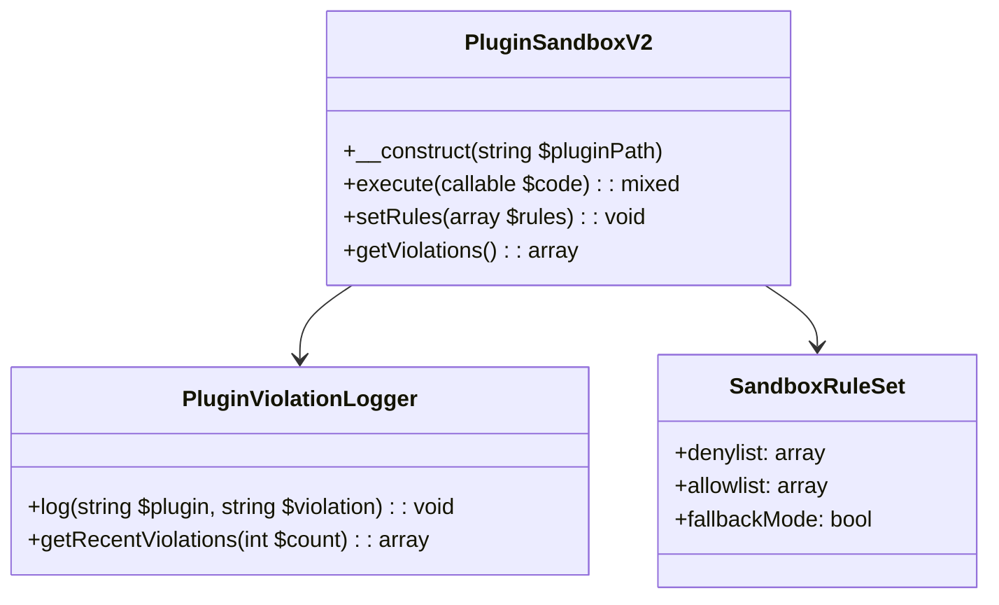

# PluginSandbox v2 Upgrade Plan

## Objective
Upgrade and harden the PluginSandbox module to version 2 with improved security, isolation, and violation detection while maintaining modularity and performance.

## Current Limitations
1. Basic denylist approach
2. No per-plugin configuration
3. No violation logging
4. Limited function coverage
5. No fallback mechanism

## Feature Roadmap

### Core Security Enhancements
1. **Expanded Denylist**:
   - File operations (`file_*`, `fopen`, `unlink`)
   - Network functions (`curl_*`, `fsockopen`)
   - Execution functions (`exec`, `system`, `passthru`)
   - Dynamic code (`eval`, `preg_replace` with /e modifier)

2. **Configurable Rules**:
   - Per-plugin allowlist/denylist via `plugin.json`
   - Default ruleset for plugins without configuration
   - Runtime rule modification

3. **Violation Detection**:
   - Function call interception
   - Pattern matching for dynamic code
   - File operation monitoring

### Architectural Components



### Implementation Details

1. **Enhanced Denylist Logic**:
```php
private $defaultDenylist = [
    // File operations
    'file_', 'fopen', 'fwrite', 'fread', 'unlink', 'rename',
    // Network
    'curl_', 'fsockopen', 'socket_',
    // Execution
    'exec', 'passthru', 'system', 'shell_exec', 'proc_',
    // Dynamic code
    'eval', 'create_function', 'preg_replace_e', 'assert'
];
```

2. **Logging Interface**:
```php
class PluginViolationLogger {
    public function log(string $plugin, string $violation): void {
        $entry = sprintf(
            "[%s] %s: %s\n",
            date('Y-m-d H:i:s'),
            $plugin,
            $violation
        );
        file_put_contents($this->logFile, $entry, FILE_APPEND);
    }
}
```

3. **Fallback Mechanism**:
- Safe mode execution
- Limited functionality
- Admin notifications

## Migration Path
1. Create new `PluginSandboxV2` class
2. Update `PluginManager` to support both versions
3. Add configuration options to `plugin.json` schema
4. Implement violation logger
5. Add tests for new functionality

## Risk Mitigation
1. Performance impact testing
2. Backward compatibility checks
3. Fallback mode validation
4. Security audit of new patterns