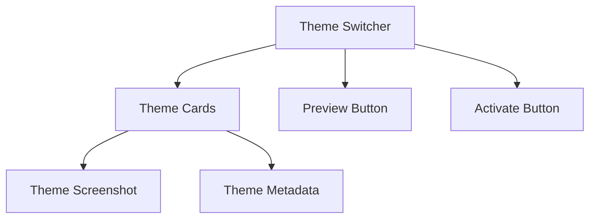

# Admin Theme Switcher Design

## Requirements
1. Allow admin to switch between installed admin themes
2. Preview theme before activation
3. Maintain separate theme selection for admin vs public
4. Store selection in database with session fallback

## Interface Components


## Database Changes
- Add `admin_theme` column to `site_settings` table
- New table `available_themes`:
  ```sql
  CREATE TABLE available_themes (
    id INT AUTO_INCREMENT PRIMARY KEY,
    theme_path VARCHAR(255),
    theme_type ENUM('admin','public'),
    is_active BOOLEAN DEFAULT false,
    added_at TIMESTAMP DEFAULT CURRENT_TIMESTAMP
  );
  ```

## Implementation Steps
1. Create ThemeSwitcherController in `admin/controllers/`
2. Add switcher UI to admin dashboard
3. Implement preview functionality using iframe
4. Add theme activation endpoint
5. Update ThemeManager to handle admin theme context

## Testing Strategy
1. Verify theme switching persists after logout
2. Test preview functionality
3. Verify public/admin themes operate independently
4. Check fallback to session storage when DB unavailable