# AI Content Generation Integration Plan

## Overview
Phase 18 implements AI-powered content features while maintaining shared hosting compatibility. The system will provide:
- API integration with OpenAI/HuggingFace
- Context-aware content suggestions
- Automated content improvements
- Editor integration tools

```mermaid
graph TD
    A[AI Content Generation] --> B[API Integration]
    A --> C[Content Suggestion]
    A --> D[Automated Improvement]
    A --> E[Editor Integration]

    B --> F[Service: OpenAI/HuggingFace]
    B --> G[Authentication: API Key Management]
    B --> H[Features: Rate Limiting, Caching]
    B --> I[Fallback: Local Suggestions]

    C --> J[Trigger: Manual/Auto]
    C --> K[Context: Content Type, History]
    C --> L[Storage: Versioned Suggestions]
    C --> M[Tracking: Acceptance Rate]

    D --> N[Rules: Readability, SEO]
    D --> O[Auto-Apply Thresholds]
    D --> P[User Override Options]
    D --> Q[Change Justification]

    E --> R[UI: Inline Highlights]
    E --> S[Controls: Accept/Reject]
    E --> T[Feedback: Thumbs Up/Down]
    E --> U[Analytics: Usage Metrics]
```

## Implementation Details

### 1. API Integration Layer
- REST-based service wrapper (`services/AIContentService.php`)
- API key management via admin panel
- Rate limiting (10 requests/minute default)
- Response caching (1 hour TTL)
- Fallback to local suggestion engine when API unavailable

### 2. Content Suggestion Engine
- Triggered manually or based on content type
- Context analysis using:
  - Current content structure
  - Previous versions
  - Similar content in system
- Stored as "suggestion" versions (content_versions table)
- Tracks user acceptance rate for tuning

### 3. Automated Improvement System
- Rule-based quality checks:
  - Flesch-Kincaid readability (target >60)
  - SEO keyword density (3-5%)
  - Style consistency checks
- Configurable auto-apply thresholds (50-100% confidence)
- User override capabilities
- Documents change justifications

### 4. Editor Tools Integration
- Inline suggestion highlights
- Accept/reject controls
- Feedback collection (thumbs up/down)
- Usage analytics dashboard

## Technical Requirements
- PHP 8.1+
- MySQL 5.7+
- 256MB memory minimum
- HTTPS required for API calls

## Implementation Timeline
1. Week 1: API integration layer
2. Week 2: Suggestion engine core
3. Week 3: Automated improvement rules
4. Week 4: Editor UI integration