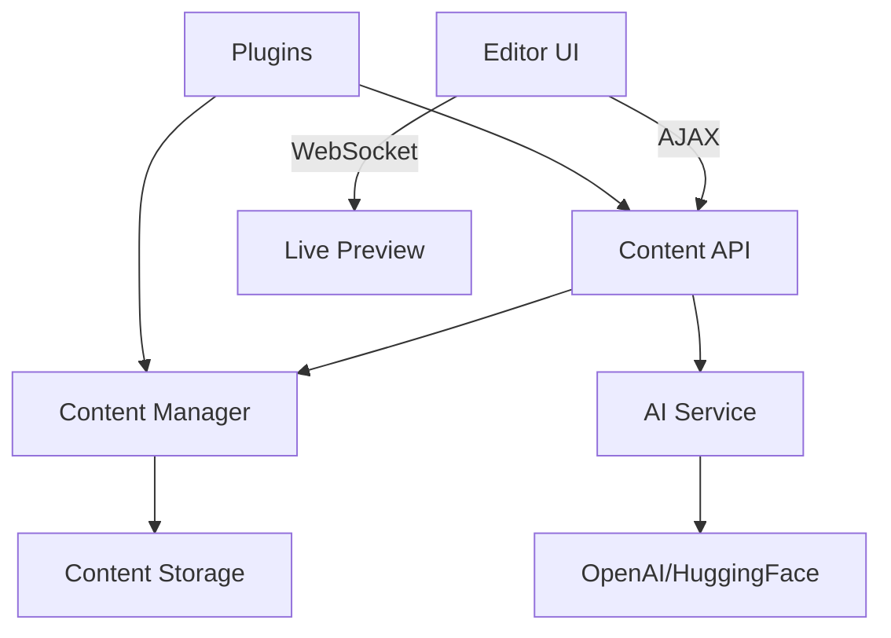

# AI-Assisted Content Editor Implementation Plan

## 1. System Architecture


## 2. Content Block Types
- **Text Block**: Rich text with formatting
- **Media Block**: Images/videos with captions
- **Shortcode Block**: Predefined macros
- **Plugin Block**: Custom plugin content
- **Layout Block**: Structural elements

## 3. Content Structure Format
```json
{
  "version": "1.0",
  "blocks": [
    {
      "type": "text",
      "data": {
        "content": "Hello world",
        "format": "html"
      },
      "aiMeta": {
        "suggestions": ["Alternative phrasing"],
        "prompt": "Make more engaging"
      }
    }
  ],
  "meta": {
    "title": "Page Title",
    "seoDescription": "...",
    "tags": []
  }
}
```

## 4. AI Integration
- **Secure Endpoint**: `/api/ai/generate`
- **Prompt Validation**:
  - Block malicious patterns
  - Limit prompt length
  - Rate limiting (5 RPM)
- **Caching**: Store common suggestions

## 5. UI/UX Flow
1. **Editor Layout**:
   - Left: Block palette
   - Center: Editing canvas
   - Right: AI tools panel
2. **AI Features**:
   - Content suggestions
   - SEO optimization
   - Tone adjustment
   - Layout recommendations

## 6. Plugin Integration
- **Hook Points**:
  - `register_block_types`
  - `ai_suggestion_filters`
  - `content_save_validation`
- **Sandboxing**:
  - Isolated JS execution
  - Limited DOM access
  - API whitelisting

## 7. Security Measures
- **Frontend**:
  - Content sanitization
  - CSP headers
  - Plugin sandboxing
- **Backend**:
  - Prompt validation
  - Rate limiting
  - Output filtering

## Implementation Roadmap
1. Phase 1: Core editor with text/media blocks (2 weeks)
2. Phase 2: AI integration (1 week)
3. Phase 3: Plugin system (2 weeks)
4. Phase 4: Security hardening (1 week)