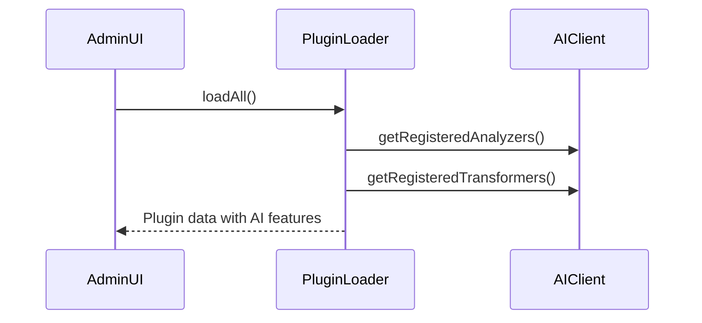

# AI Plugin UI Integration Plan

## Objective
Connect existing PluginLoader and AIClient functionality to admin UI

## Implementation Steps

1. **Admin UI Updates** (`admin/plugins/index.php`)


2. **Required Changes**
- Replace placeholder notice with actual plugin listing
- Add section for AI tools display
- Implement status indicators for active plugins

3. **Code Structure**
```php
// Load all plugins with AI features
$plugins = PluginLoader::loadAll();
$aiAnalyzers = AIClient::getRegisteredAnalyzers();
$aiTransformers = AIClient::getRegisteredTransformers();

// Display logic
foreach ($plugins as $plugin) {
    if (PluginLoader::hasAIFeatures($plugin)) {
        // Show AI capabilities
    }
}
```

4. **Validation**
- Verify FTP deployment works
- Test with sample plugins
- Check admin permissions

## Timeline
1. UI updates - 2 hours
2. Testing - 1 hour
3. Documentation - 30 minutes