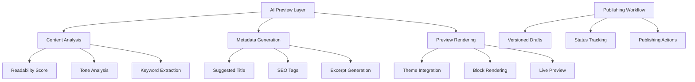

# AI-Powered Preview & Publishing Implementation Plan

## 1. Architecture Overview

## 2. Key Components

### AIPreviewService.php
- Interfaces with existing AI endpoints
- Provides content analysis (readability, tone)
- Generates metadata suggestions
- Returns structured feedback

### PreviewRenderer.php  
- Renders content in current theme context
- Handles plugin block rendering
- Supports live preview updates
- Respects theme constraints

### PublishingWorkflow.php
- Manages content states (Draft/Pending/Published/Archived)
- Handles versioning and change tracking
- Provides publishing actions (schedule/publish/revert)
- Stores metadata in content JSON

## 3. Implementation Steps

1. Create new service classes
2. Add API endpoints for preview/publish actions  
3. Develop Vue components for UI integration
4. Extend content JSON schema with publishing metadata
5. Integrate with existing version control system
6. Add theme-aware preview rendering