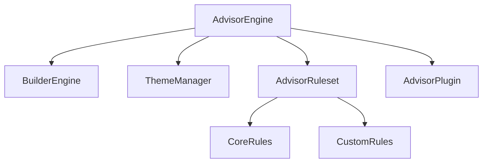

# AI Design Advisor Architecture

## Core Features

### MVP (v1.0)
- Static layout analyzer:
  - Block spacing consistency
  - Block order/flow analysis
  - Block usage patterns
- Theme analyzer:
  - Color contrast validation
  - Font pairing suggestions
  - Spacing system verification
- Rule-based heuristics:
  - "Too many elements in one row"
  - "Inconsistent padding/margins"
  - "Poor visual hierarchy"

### Core (v1.1)
- JSON export of suggestions
- Builder integration ("Analyze" button)
- n8n workflow triggers
- Plugin system hooks

### Optional (v1.2+)
- AI-powered scoring
- Dynamic recommendation text
- Historical improvement tracking
- Multi-theme comparison

## Module Structure



## File Structure
```
modules/AIAdvisor/
├── AdvisorEngine.php       # Main analysis engine
├── AdvisorRuleset.php      # Rule definitions
├── AdvisorPlugin.php       # Optional plugin integration
├── rules/                  
│   ├── LayoutRules.php     # Layout-specific rules
│   └── ThemeRules.php      # Theme-specific rules
└── interfaces/
    └── AdvisorInterface.php # Integration contracts
```

## Example Suggestion JSON
```json
{
  "layoutId": "homepage-v2",
  "issues": [
    {
      "type": "spacing",
      "blocks": ["hero", "features"],
      "message": "Inconsistent vertical spacing (24px vs 32px)",
      "severity": "warning",
      "suggestions": ["32px uniform spacing"]
    }
  ],
  "score": 82,
  "generatedAt": "2025-06-14T19:07:26Z"
}
```

## Integration Notes
1. Builder Engine:
   - Add "Analyze" button to layout editor
   - Store suggestions as layout metadata

2. Theme Manager:
   - Validate theme.json against rules
   - Suggest palette adjustments

3. Risk Mitigation:
   - Clearly mark as suggestions only
   - Allow disabling specific rule types
   - Rate limit AI suggestions