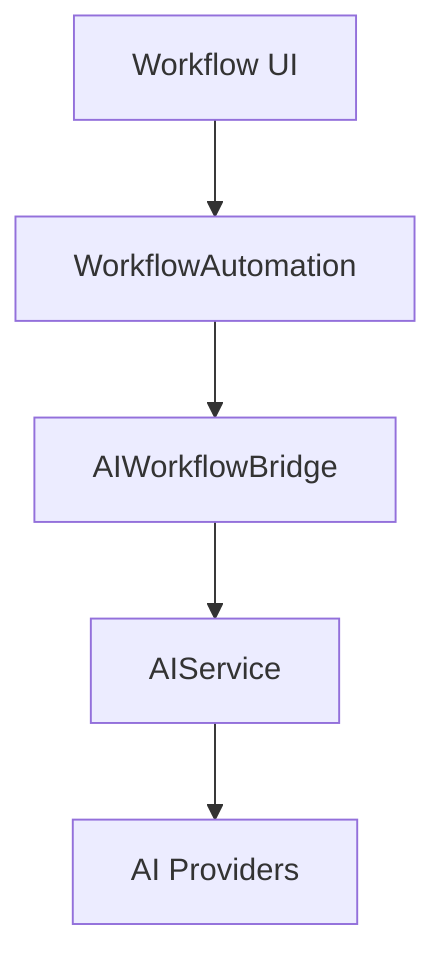

# AI-Workflow Integration Plan

## Architecture Overview

## Implementation Phases

### Phase 1: Core Integration
1. Create `AIWorkflowBridge` class
2. Extend `WorkflowAutomation` with AI trigger types:
   - `ai_content_generation`
   - `ai_classification`
   - `ai_moderation`
3. Add AI action types:
   - `ai_generate_content`
   - `ai_analyze_text`
   - `ai_moderate_content`

### Phase 2: UI Modifications
1. Add AI provider selection to workflow UI
2. Create AI-specific trigger configuration
3. Add action parameter inputs

### Phase 3: Testing
1. Unit tests for bridge class
2. Integration tests with mock providers
3. End-to-end workflow tests

## Required File Modifications
1. `services/WorkflowAutomation.php`:
   - Add AI trigger handling
   - Inject AIService dependency
2. `admin/workflow/automation.php`:
   - Add AI-specific UI components
3. New files:
   - `services/AIWorkflowBridge.php`
   - `tests/AIWorkflowTest.php`

## Dependencies
1. AIService must be initialized first
2. Workflow UI requires Vue.js components update
3. Need new database fields for AI config