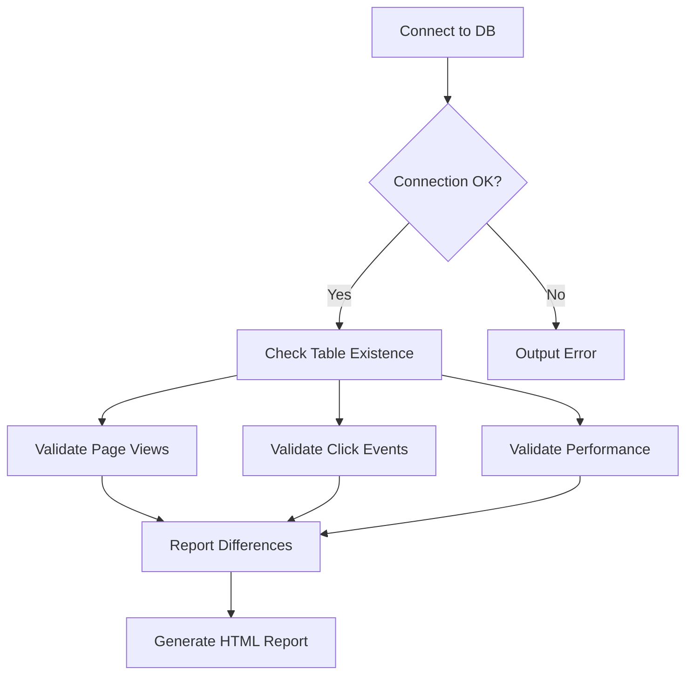

# Analytics Tables Validation Plan

## Purpose
Verify existence and schema of analytics database tables:
1. analytics_page_views
2. analytics_click_events  
3. analytics_performance_metrics

## Database Connection
```php
$config = require 'config/database.php';
$dsn = "mysql:host={$config['connections']['mysql']['host']};dbname={$config['connections']['mysql']['database']}";
$pdo = new PDO($dsn, $config['connections']['mysql']['username'], $config['connections']['mysql']['password'], $config['options']);
```

## Validation Process


## Expected Schemas
### analytics_page_views
- id INT AUTO_INCREMENT PRIMARY KEY
- session_id VARCHAR(255) NOT NULL
- page_url VARCHAR(512) NOT NULL
- referrer_url VARCHAR(512)
- user_id INT
- device_type VARCHAR(50)
- view_time TIMESTAMP DEFAULT CURRENT_TIMESTAMP
- Indexes: session_id, user_id, view_time

### analytics_click_events
- id INT AUTO_INCREMENT PRIMARY KEY
- session_id VARCHAR(255) NOT NULL
- element_id VARCHAR(255)
- element_class VARCHAR(255)
- element_type VARCHAR(50)
- page_url VARCHAR(512) NOT NULL
- click_time TIMESTAMP DEFAULT CURRENT_TIMESTAMP
- Indexes: session_id, element_id, click_time

### analytics_performance_metrics
- id INT AUTO_INCREMENT PRIMARY KEY
- endpoint VARCHAR(255) NOT NULL
- response_time FLOAT NOT NULL
- status_code INT
- error_message TEXT
- recorded_at TIMESTAMP DEFAULT CURRENT_TIMESTAMP
- Indexes: endpoint, recorded_at

## Output Format
HTML report showing:
- Connection status
- Table existence
- Schema validation results
- Missing indexes
- Data type mismatches

## Logging
Results will be logged to:
- memory-bank/progress.md
- memory-bank/decisionLog.md