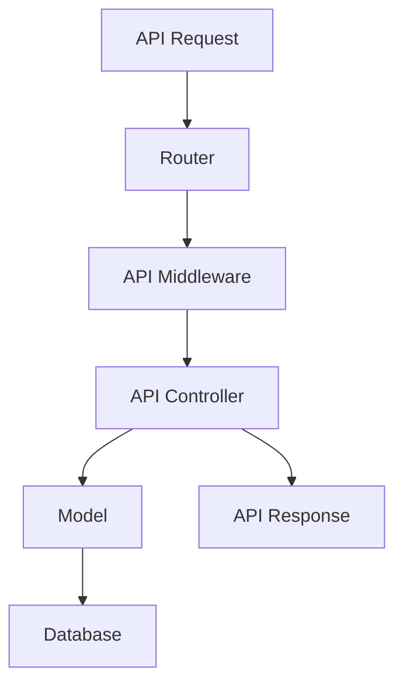
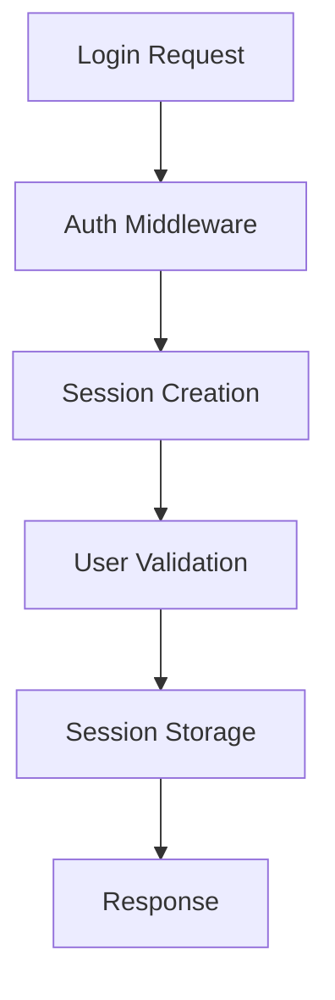
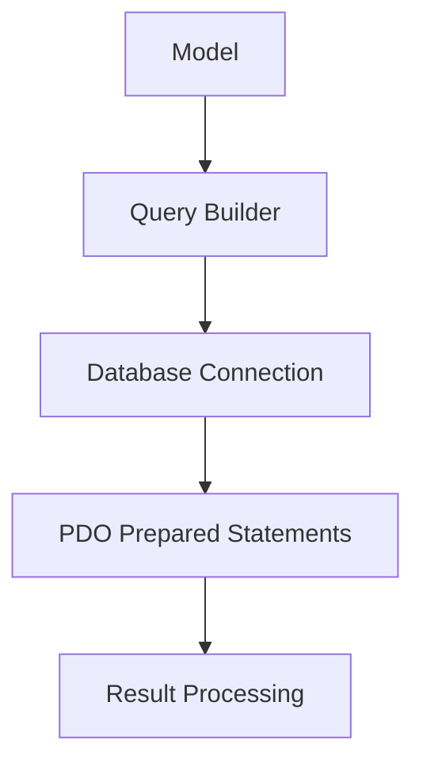
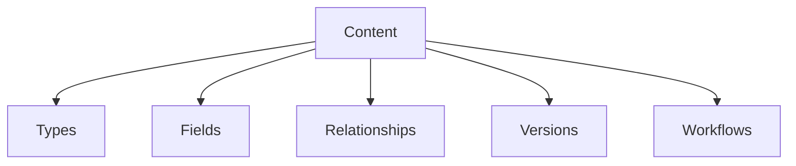
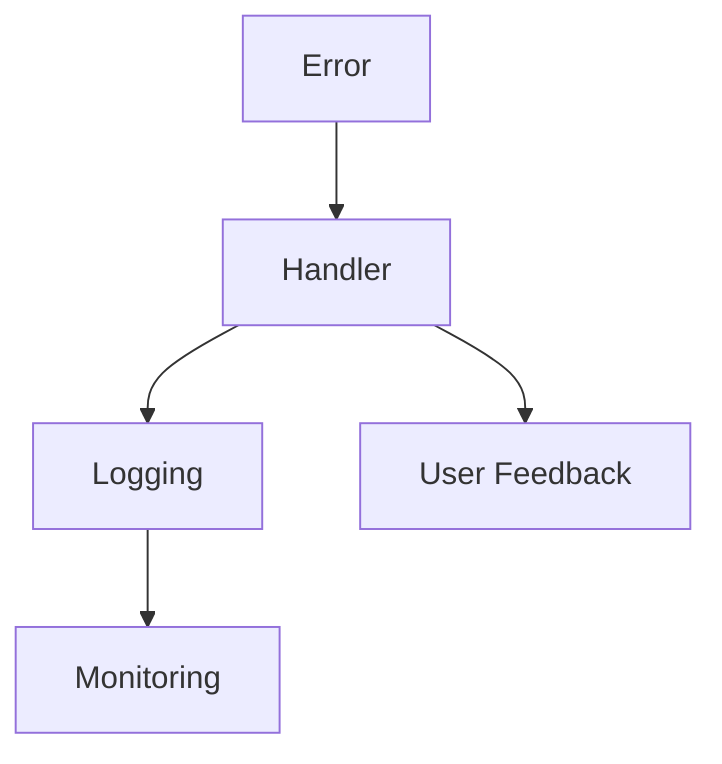

# Pure PHP CMS - API and Core Architecture Plan

## 1. JSON API Implementation Strategy

### Implementation Details
- RESTful endpoints under `/api/` namespace
- JSON request/response format
- HTTP status codes for responses
- Rate limiting middleware
- API key authentication for external access
- Input validation for all endpoints

### Security Considerations
- CSRF protection for state-changing requests
- Input sanitization
- Rate limiting
- API key rotation

## 2. Authentication System Design

### Components
- Session-based authentication
- Password hashing with PHP 8.1+ password_hash()
- Role-based access control
- Remember me functionality
- Password reset flow
- Failed login throttling

### Security Measures
- Secure session handling
- Password strength requirements
- Account lockout after failed attempts
- Session expiration

## 3. Database Interaction Patterns

### Implementation
- PDO for database access
- Prepared statements for all queries
- Lightweight query builder
- Connection pooling
- Database abstraction layer

### Security
- SQL injection protection
- Input validation
- Sensitive data encryption
- Query logging for debugging

## 4. Content Management Structure

### Components
- Content type definitions
- Custom fields system
- Version control
- Draft/publish workflow
- Revision comparison
- Content relationships

### Security
- Content ownership
- Role-based permissions
- Change logging
- Backup system

## 5. Error Handling Approach

### Implementation
- Custom error handler
- Logging to file/database
- User-friendly error pages
- API error responses
- Debug mode vs production mode

### Security
- No sensitive data in error messages
- Error logging with sanitization
- Rate limiting on error responses

## Implementation Roadmap

| Phase | Component | Duration | Dependencies |
|-------|-----------|----------|--------------|
| 1 | Core API Structure | 3 days | - |
| 2 | Authentication System | 4 days | Phase 1 |
| 3 | Database Layer | 3 days | Phase 1 |
| 4 | Content Management | 5 days | Phase 2,3 |
| 5 | Error Handling | 2 days | All phases |
| 6 | Testing & Security | 4 days | All phases |