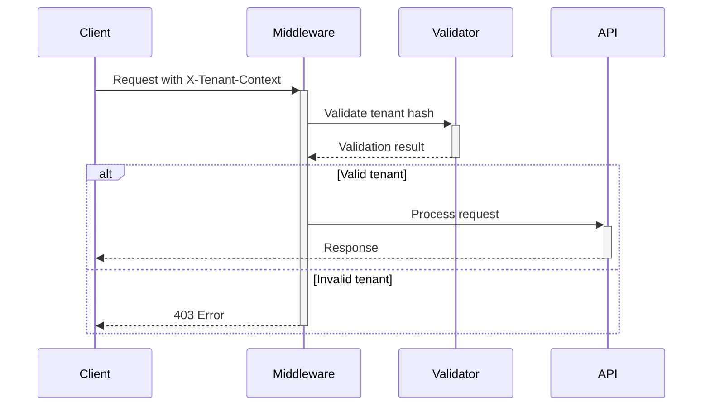
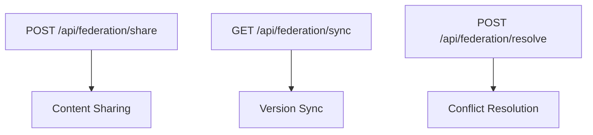

# API Integration Implementation Plan

## 1. Directory Structure
```
/api
  /federation
    share.php       # Content sharing endpoint
    sync.php        # Version synchronization
    resolve.php     # Conflict resolution
  /middleware
    TenantIsolation.php
    RateLimiter.php
  /services
    FederationService.php
    VersionService.php
```

## 2. Core Components

### Tenant Isolation Middleware


### Federation Endpoints


## 3. Security Implementation
- Tenant hash format: `tenant_[a-z0-9]{32}`
- Header requirement: `X-Tenant-Context`
- Role-based access control matrix
- Prepared statements for all SQL queries

## 4. Error Handling
Standardized error response format:
```json
{
  "error": {
    "code": "TENANT_VIOLATION",
    "message": "Invalid tenant context",
    "timestamp": "ISO8601",
    "details": {}
  }
}
```

## 5. Rate Limiting

```mermaid
gantt
    title Rate Limit Strategy
    dateFormat  HH:mm
    section Global
    System-wide :a1, 00:00, 60s
    section Per-Tenant
    Tenant-A :a2, 00:00, 10s
    Tenant-B :a3, 00:00, 10s
```


## 6. Testing Strategy
1. Tenant isolation verification
2. Version conflict scenarios
3. Rate limiting tests
4. Error response validation
5. Bulk operation tests

## 7. Documentation Requirements
- API specification in OpenAPI format
- Version migration guides
- Deprecation policy
- Example requests/responses

## 8. Compliance Verification
- Static methods only
- No framework dependencies
- Pure PHP 8.1+
- FTP-deployable structure

## Task Delegation
1. **Code Mode**: Implement core endpoints
2. **DB-Support Mode**: Update tenant ID format
3. **Debug Mode**: Create test cases
4. **Documents Mode**: Generate API docs