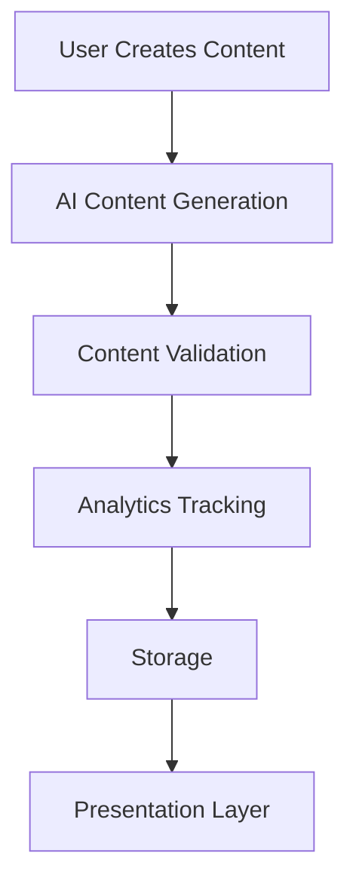

# CMS Architecture Review

## Core Modules
1. **AI Integration Layer**
   - REST API endpoints (generate, validate, suggest-revisions)
   - Prompt management (user-specific, model configuration)
   - Content validation workflows
   - Revision suggestion system

2. **Analytics System**
   - Event tracking (flexible payload structure)
   - API usage monitoring
   - Content quality metrics
   - Performance tracking

3. **Content Management**
   - Page builder (not yet implemented)
   - Version control (migrations exist)
   - Moderation workflows (email notifications in place)

4. **Plugin System**
   - Modular architecture (planned)
   - Hook system
   - API integration points

## Key Workflows

## Implementation Status
| Module | Status | Notes |
|--------|--------|-------|
| AI Integration | In Progress | Core endpoints complete, prompt management implemented |
| Analytics | Started | Basic event tracking implemented |
| Page Builder | Not Started |  |
| Plugin System | Planned | Needs architecture definition |
| Theme System | Not Started |  |
| Admin Panel | Partial | Auth system in place |

## Architectural Decisions
1. Using REST APIs for all external integrations
2. File-based routing for shared hosting compatibility
3. JSON payloads for analytics events
4. User-specific prompt management
5. Modular plugin architecture