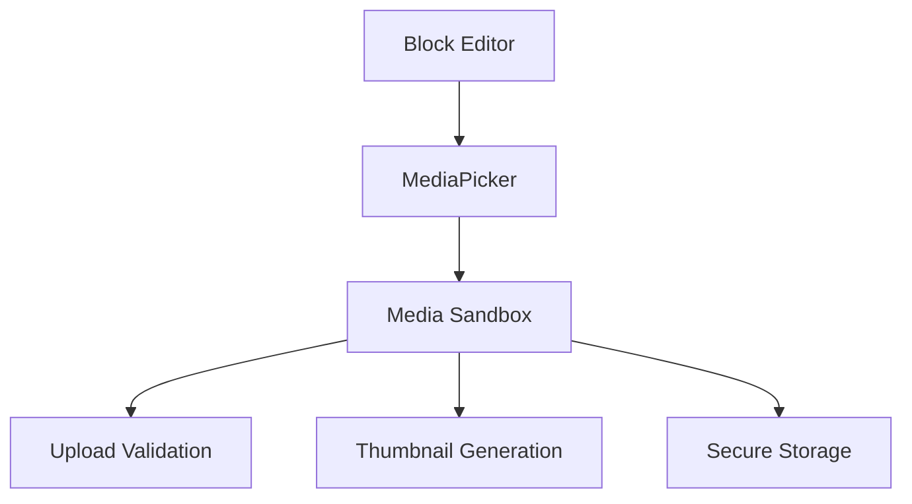

# Block Handler Architecture Plan

## 1. Base BlockHandler Interface (PHP)
```php
interface BlockHandler {
    public function renderEdit(array $blockData): string;
    public function renderPreview(array $blockData): string;
    public function serialize(array $blockData): string;
    public function deserialize(string $serialized): array;
}

abstract class BaseBlockHandler implements BlockHandler {
    // Common functionality for all blocks
}
```

## 2. Block Type Interfaces
```php
interface TextBlockHandler extends BlockHandler {
    public function validateText(string $text): bool;
}

interface ImageBlockHandler extends BlockHandler {
    public function validateImage(array $imageData): bool;
    public function getThumbnail(array $imageData): string;
}

interface VideoBlockHandler extends BlockHandler {
    public function validateVideo(array $videoData): bool;
    public function getEmbedCode(array $videoData): string;
}
```

## 3. JSON Schema for Block Storage
```json
{
  "$schema": "http://json-schema.org/draft-07/schema#",
  "type": "object",
  "properties": {
    "type": {"type": "string"},
    "data": {"type": "object"},
    "meta": {
      "type": "object",
      "properties": {
        "created": {"type": "string", "format": "date-time"},
        "modified": {"type": "string", "format": "date-time"},
        "position": {"type": "integer"}
      }
    }
  },
  "required": ["type", "data"]
}
```

## 4. Drag/Drop Reordering
- Extend existing BuilderApp drag/drop
- Add position tracking in block meta
- Implement smooth reordering with CSS transitions

## 5. Media Sandbox Integration


## 6. Implementation Plan
1. Create `/handlers/BlockHandler.php` base interface
2. Implement block handlers in `/handlers/blocks/`
3. Add JS block rendering in `/public/js/blocks/`
4. Extend BuilderApp for block management
5. Document API in `/docs/block-system.md`