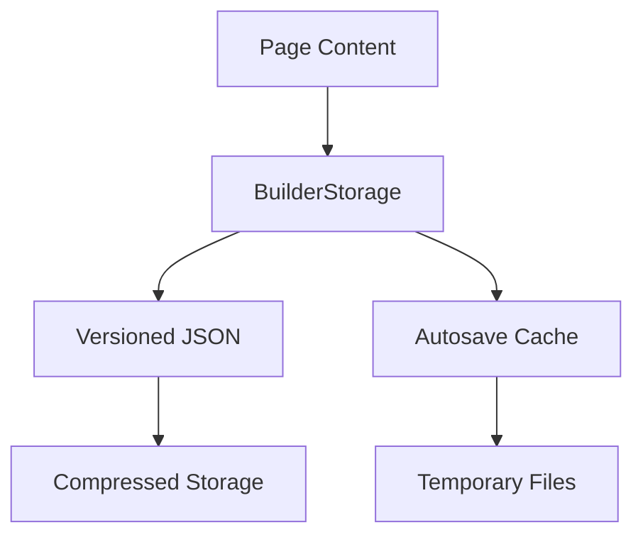

# Builder Engine v2 Architecture

## Core Components

1. **Storage Layer**

2. **Theme Integration**
- Inheritable theme structure
- Template resolution hierarchy
- Block-level theme overrides

3. **Version Control**
- Atomic version commits
- Three-way merge capability
- Change tracking by block

4. **Admin Interface**
- Vue-based component library
- Real-time preview
- Version comparison tools

## Implementation Plan

### Phase 1: Storage Optimization
- Implement compression for JSON storage
- Add autosave garbage collection
- Create migration for existing content

### Phase 2: Theme System
- Extend template resolution
- Add block-level theme hooks
- Implement inheritance validation

### Phase 3: Versioning
- Build diff/merge engine
- Create version rollback UI
- Add change tracking

### Phase 4: Admin UI
- Develop Vue component library
- Implement real-time preview
- Build version comparison tools