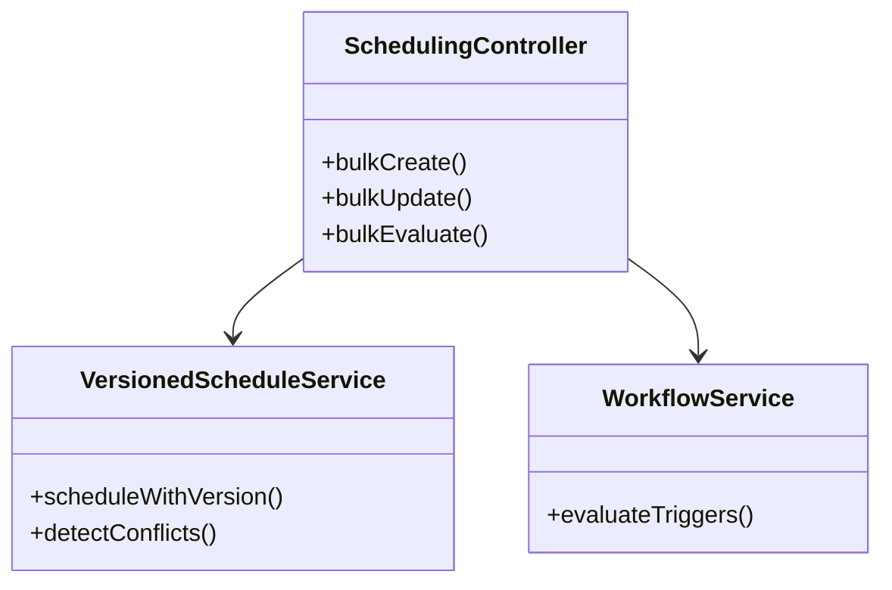

# Bulk Scheduling Enhancements Plan

## Current Architecture


## Proposed Enhancements

### 1. Complete Bulk Operations
- Implement full `bulkUpdate` functionality
- Add `bulkDelete` endpoint
- Add `bulkStatusChange` for publish/unpublish

### 2. Enhanced Conflict Handling
- Add conflict resolution options:
  - Overwrite
  - Skip
  - Merge
- Return detailed conflict reports

### 3. Recurring Events
- Implement full recurring events support:
  - Daily/weekly/monthly patterns
  - End conditions (date/occurrences)
  - Exception dates

### 4. New API Endpoints
```rest
POST /api/v1/schedules/bulk/delete
{
  "event_ids": [1,2,3],
  "confirm": true
}

POST /api/v1/schedules/bulk/status
{
  "event_ids": [1,2,3],
  "status": "published",
  "publish_at": "2025-05-18T08:00:00Z"
}
```

### 5. Performance Considerations
- Batch size limits (100 events max)
- Async processing option for large batches
- Progress tracking endpoint

### 6. UI Integration Points
- Bulk selection interface
- Conflict resolution dialog
- Status change confirmation