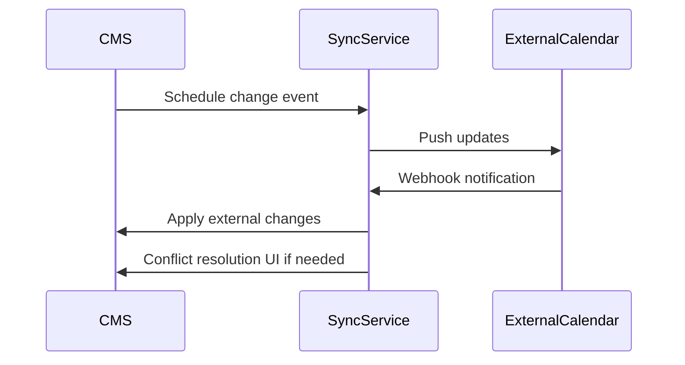

# Calendar Integration Enhancement Plan

## 1. External Calendar API Integration Strategy

### Google Calendar API
- Use REST API with OAuth 2.0
- Required scopes: `calendar.events` (read/write)
- Rate limit handling: 100 queries per 100 seconds
- Webhook setup for change notifications

### Outlook Calendar API
- Microsoft Graph API integration  
- OAuth 2.0 with `Calendars.ReadWrite` scope
- Delta query for change tracking
- Batch request support for bulk operations

### iCal Export
- Generate standard .ics files
- Public/private export options
- Recurrence rule support
- Attendee management

## 2. Synchronization Architecture

### Conflict Resolution Approach
- Last-write-wins with manual override option  
- Three-way merge for recurring events
- Change history tracking

### Change Detection
- Webhooks for real-time updates
- Periodic full sync (daily)
- Version hashing for efficient change detection

## 3. Security Considerations

### OAuth Implementation
- Token storage in encrypted database field
- Short-lived access tokens (1 hour)
- Long-lived refresh tokens (90 days)
- Token rotation implementation

### Permission Scopes
- Minimal required permissions
- User-controlled scope approval
- Admin override capability

## 4. User Interface Requirements

### Calendar Connection Management
- Connection status indicators
- Account linking/unlinking
- Permission management

### Sync Status Visualization  
- Last sync time
- Pending changes
- Sync errors

### Conflict Resolution UI
- Side-by-side comparison
- Merge options
- Change history view

## 5. Implementation Roadmap

| Phase | Component | Effort | Dependencies |
|-------|-----------|--------|--------------|
| 1 | Google Calendar API | Medium | OAuth service |
| 2 | Outlook Calendar API | High | Microsoft auth |
| 3 | iCal Export | Low | None |  
| 4 | Sync Service Core | High | Phase 1-3 |
| 5 | Conflict Resolution | Medium | Phase 4 |
| 6 | UI Integration | Medium | Phase 1-5 |