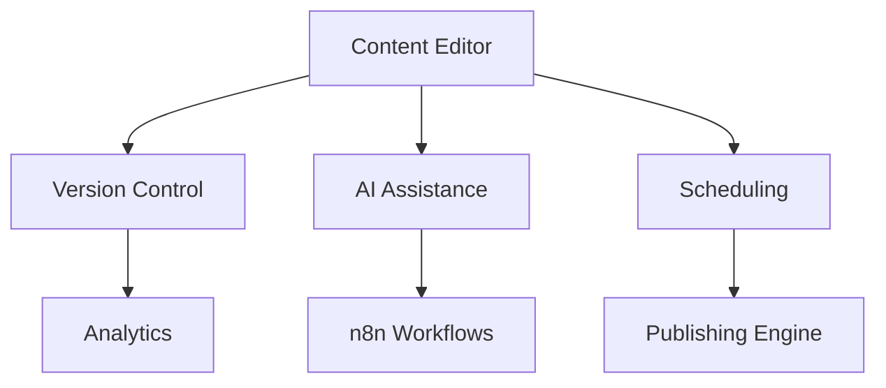

# CMS Implementation Plan

## 1. Version Analytics System
**Phase 1: Core Tracking (2 weeks)**
- Implement version metadata storage
- Create version comparison UI
- Track basic metrics (views, edits)

**Phase 2: Advanced Analytics (3 weeks)**
- User behavior tracking
- Content performance metrics
- Version impact analysis

**Deliverables:**
- Version history dashboard
- Content performance reports
- Rollback impact analysis

**Dependencies:** 
- Requires content versioning system
- Needs RBAC for access control

## 2. AI Content Assistance
**Phase 1: Core Integration (3 weeks)**
- Implement OpenAI/Hugging Face REST API
- Create content generation endpoints
- Basic prompt templates

**Phase 2: Advanced Features (4 weeks)**
- Context-aware suggestions
- Style adaptation
- Bulk content generation

**Deliverables:**
- AI content generation API
- Admin UI for AI tools
- Content suggestion system

**Dependencies:**
- Requires API credentials
- Needs content storage system

## 3. Scheduling System
**Phase 1: Core Scheduling (2 weeks)**
- Single event scheduling
- Basic conflict detection
- Permission integration

**Phase 2: Advanced Features (3 weeks)**
- Recurring events
- Bulk scheduling
- Conditional publishing

**Deliverables:**
- Scheduling UI
- Conflict detection system
- Publishing workflow

## Integration Points


## Testing Strategy
1. **Unit Testing:** Core components
2. **Integration Testing:** System interactions
3. **User Acceptance:** Editor workflows

## Deployment Approach
1. Staging environment validation
2. Incremental feature rollout
3. Automated backup system

## Resource Requirements
- 2 PHP developers (4 months)
- 1 Frontend developer (3 months)
- QA specialist (2 months)

## Risk Assessment
| Risk | Mitigation |
|------|------------|
| API rate limits | Implement caching |
| Hosting limits | Optimize queries |
| Content conflicts | Version locking |

## Timeline
```mermaid
gantt
    title CMS Development Timeline
    dateFormat  YYYY-MM-DD
    section Core
    Version Analytics :a1, 2025-06-01, 30d
    AI Integration    :a2, after a1, 45d
    Scheduling        :a3, 2025-06-15, 30d
    section Integration
    Testing           :2025-07-15, 30d
    Deployment        :2025-08-15, 14d