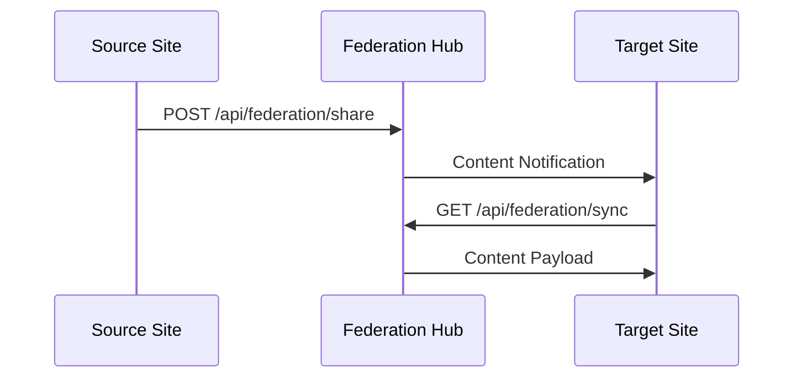
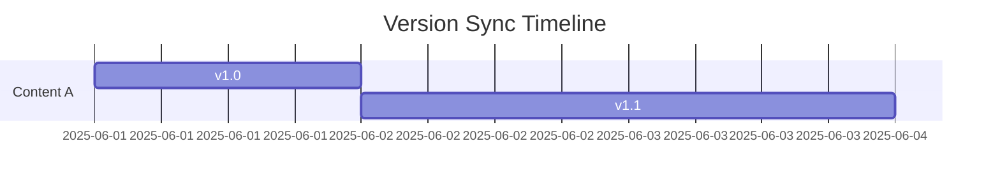

# Content Federation Architecture

## 1. Cross-Site Sharing Protocol


## 2. Permission Propagation System
```php
// Permission mapping example
$permissionMap = [
    'source_role' => 'target_role',
    'editor' => 'contributor',
    'admin' => 'moderator'
];
```

## 3. Version Synchronization


## 4. Conflict Resolution Strategies
| Strategy | Use Case | Implementation |
|----------|----------|----------------|
| Last Write Wins | Non-critical | Timestamp compare |
| Manual Merge | Complex | Admin interface |

## Implementation Roadmap
1. **Phase 1: Core Federation (2 weeks)**
   - Sharing protocol
   - Basic permissions

2. **Phase 2: Advanced (1 week)**
   - Conflict UI
   - Bulk ops

## Security
- Tenant isolation
- Content signing
- Rate limiting