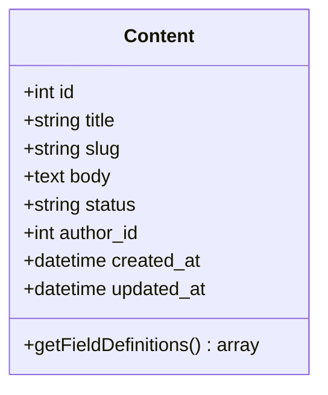
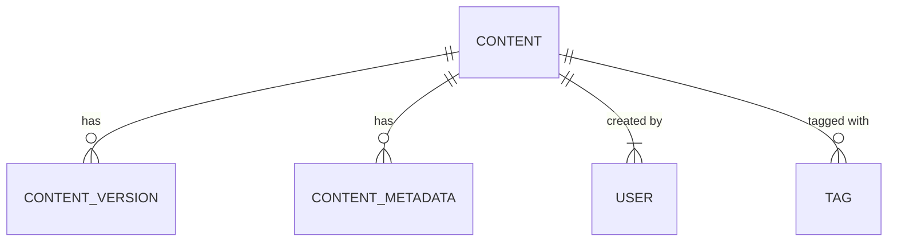
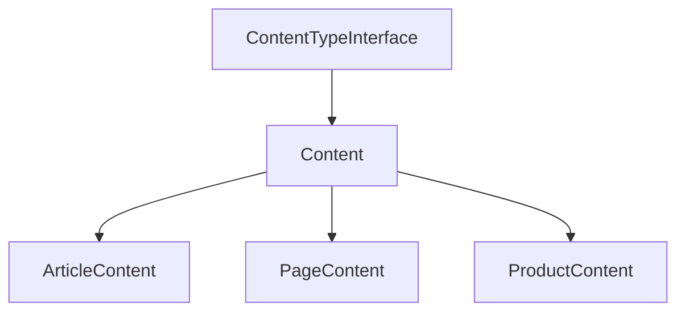
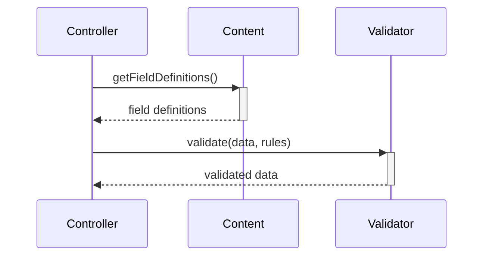
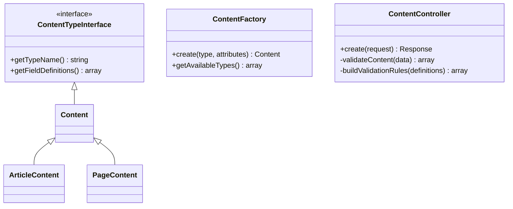

# Content Model Architecture Specification

## 1. Core Content Entity Structure

### Base Fields


### Relationships


## 2. Content Type System Design

### Type Hierarchy


### Field Definitions
- Each content type implements `getFieldDefinitions()`
- Field types supported:
  - String (with max length)
  - Text
  - Number
  - Boolean
  - Date
  - Enum (dropdown)
  - Relationship

## 3. Storage Requirements

### Database Schema
```sql
CREATE TABLE contents (
    id INT AUTO_INCREMENT PRIMARY KEY,
    type VARCHAR(50) NOT NULL,
    title VARCHAR(255) NOT NULL,
    slug VARCHAR(255) NOT NULL UNIQUE,
    body TEXT,
    status ENUM('draft','published','archived') DEFAULT 'draft',
    author_id INT NOT NULL,
    created_at TIMESTAMP DEFAULT CURRENT_TIMESTAMP,
    updated_at TIMESTAMP DEFAULT CURRENT_TIMESTAMP ON UPDATE CURRENT_TIMESTAMP,
    FOREIGN KEY (author_id) REFERENCES users(id)
);

CREATE TABLE content_versions (
    id INT AUTO_INCREMENT PRIMARY KEY,
    content_id INT NOT NULL,
    version_number INT NOT NULL,
    is_autosave BOOLEAN DEFAULT FALSE,
    created_at TIMESTAMP DEFAULT CURRENT_TIMESTAMP,
    FOREIGN KEY (content_id) REFERENCES contents(id)
);
```

## 4. Validation Rules

### Validation Flow


### Rule Types
- Required fields
- Data type validation
- Length restrictions
- Pattern matching (regex)
- Enum value checking

## 5. Integration Points

### Existing Database Layer
- Uses `DatabaseConnection` singleton
- Implements `Model` base class methods:
  - `save()`
  - `update()`
  - `delete()`
  - `find()`

### Versioning System
- Hook into `beforeSave` event
- Create version snapshot
- Store diff in `content_versions` table

## Implementation Classes

### Class Structure


## Deployment Considerations
- All code is pure PHP 8.1+
- No Composer dependencies
- Database migrations included in `/database/migrations`
- FTP deployment compatible