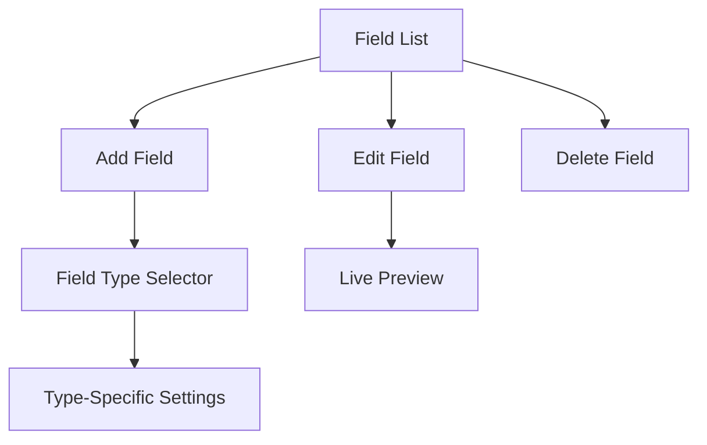

# Content Type Admin Interface Improvements

## Current State Analysis
- Basic CRUD functionality exists
- Field management is functional but minimal
- No preview capability
- Documentation not integrated

## Proposed Improvements

### 1. Enhanced Field Management

### 2. Content Type Preview
- Add preview tab in admin
- Show rendered output with sample data
- Toggle between different display modes

### 3. Documentation Integration
- Add help icons next to complex settings
- Link to context-sensitive documentation
- Store docs in /docs/content_types/

## Implementation Steps
1. Create new UI templates in:
   - admin/views/content_types/fields/
   - admin/views/content_types/preview/

2. Extend ContentFields class with:
   - getFieldTypeOptions()
   - renderFieldPreview()

3. Add documentation files:
   - docs/content_types/field_types.md
   - docs/content_types/preview.md

## Technical Constraints
- Must work without JavaScript
- No external dependencies
- FTP-deployable structure