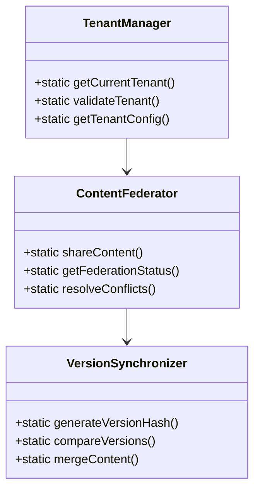

# Core Engine Implementation Plan

## 1. Component Architecture


## 2. Implementation Sequence

1. **Tenant Management**
   - Tenant identification via headers
   - Configuration inheritance
   - Isolation testing

2. **Content Federation**
   - Publish/subscribe protocol
   - Permission mapping
   - Conflict detection

3. **Version Control**
   - Content hashing
   - Change tracking
   - Merge strategies

4. **Audit Logging**
   - Action tracking
   - Change attribution
   - Security compliance

5. **Performance**
   - Tenant-aware caching
   - Query optimization
   - Monitoring hooks

## 3. File Structure
```
/includes/Core/
  ├── TenantManager.php
  ├── ContentFederator.php
  ├── VersionSynchronizer.php
  ├── AuditLogger.php
  └── PerformanceOptimizer.php
```

## 4. Testing Strategy
- Web-accessible test endpoints
- Tenant isolation verification
- Version conflict scenarios
- Performance benchmarks

## 5. Delegation Plan
1. Code mode: Core class implementations
2. DB-support: Migration files
3. Debug mode: Test scenarios