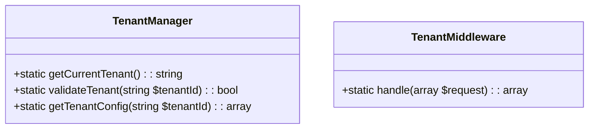

# Core Engine Integration Plan

## 1. Tenant Management Implementation (Pure PHP)


## 2. Migration Pattern (Framework-Free)
```php
// includes/Database/Migrations/CoreEngineMigration.php
class CoreEngineMigration {
    public static function applyChanges($dbConnection) {
        // Schema changes using raw SQL
        $dbConnection->query("ALTER TABLE content ADD tenant_id VARCHAR(36) NOT NULL");
    }
    
    public static function revertChanges($dbConnection) {
        // Rollback using raw SQL
        $dbConnection->query("ALTER TABLE content DROP COLUMN tenant_id");
    }
}
```

## 3. Web Test Endpoint
```php
// tests/core_engine_test.php
if (isset($_GET['test_migration'])) {
    require_once __DIR__.'/../includes/Database/Migrations/CoreEngineMigration.php';
    $db = new DatabaseConnection();
    
    if ($_GET['test_migration'] === 'apply') {
        CoreEngineMigration::applyChanges($db);
        echo "Migration applied successfully";
    } elseif ($_GET['test_migration'] === 'revert') {
        CoreEngineMigration::revertChanges($db);
        echo "Migration reverted successfully";
    }
    exit;
}
```

## Key Features:
- No Laravel patterns
- Static methods only
- Raw SQL queries
- Web-accessible testing
- No up()/down() methods