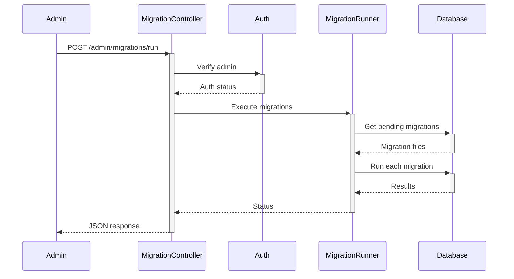

# Database Migration System Design

## 1. File Structure
```
database/
├── migrations/            # Migration files
│   ├── 2025_05_15_000000_create_migrations_table.php
│   └── ...other_migrations.php
├── MigrationRunner.php    # Core migration logic
└── SchemaBuilder.php      # Schema modification helpers
```

## 2. Core Components

### Migration Table Schema
```sql
CREATE TABLE IF NOT EXISTS migrations (
    id INT AUTO_INCREMENT PRIMARY KEY,
    migration VARCHAR(255) NOT NULL,
    batch INT NOT NULL,
    run_at TIMESTAMP DEFAULT CURRENT_TIMESTAMP
);
```

### Migration File Template
```php
<?php
// database/migrations/YYYY_MM_DD_HHMMSS_description.php
namespace Database\Migrations;

class MigrationDescription {
    public function up() {
        // Schema changes using SchemaBuilder
    }
    
    public function down() {
        // Rollback changes
    }
}
```

### SchemaBuilder Methods
```php
class SchemaBuilder {
    // Table operations
    public static function createTable(string $name, Closure $callback);
    public static function dropTable(string $name);
    public static function renameTable(string $from, string $to);
    
    // Column operations
    public static function addColumn(string $table, string $name, string $type, array $options = []);
    public static function changeColumn(string $table, string $name, string $newType, array $options = []);
    public static function dropColumn(string $table, string $name);
    
    // Index operations
    public static function addIndex(string $table, string|array $columns, string $name = null);
    public static function dropIndex(string $table, string $name);
}
```

## 3. Execution Flow



## 4. Security Measures

1. **Authentication**: Requires admin session
2. **CSRF Protection**: Token verification
3. **Input Validation**: Strict filename parsing
4. **Backups**: Automatic pre-migration backups
5. **Rate Limiting**: 1 migration batch per minute
6. **Logging**: Full audit trail

## 5. Implementation Phases

1. **Core Infrastructure**:
   - Migration table creation
   - Basic SchemaBuilder
   - MigrationRunner skeleton

2. **Browser Interface**:
   - Admin panel integration
   - Status reporting
   - Rollback capability

3. **Advanced Features**:
   - Dry-run mode
   - Backup system
   - Batch management

## 6. Constraints Compliance

- **No CLI**: Browser-executable
- **No Frameworks**: Pure PHP implementation
- **Shared Hosting**: Minimal requirements
- **No Composer**: Autoloader compatible