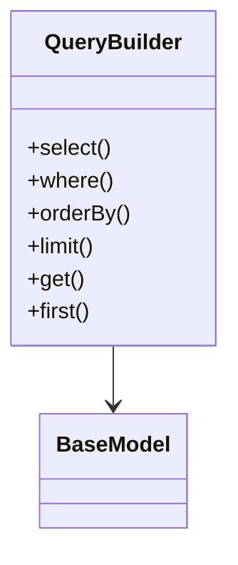

# Database Layer Refactoring Plan (Phase 2)

## Current State Analysis
- Models extend `Illuminate\Database\Eloquent\Model`
- Uses Eloquent ORM for queries and relationships
- Database migrations use Laravel schema builder
- Factories use Eloquent factories

## Proposed Architecture

### 1. Base Model Class
```php
abstract class BaseModel {
    protected static $table;
    protected $attributes = [];
    
    public static function query(): QueryBuilder;
    public static function find($id): ?self;
    public function save(): bool;
    // ... other CRUD methods
}
```

### 2. Query Builder


### 3. Relationship Handling
- Implement manual relationship methods:
```php
class User extends BaseModel {
    public function posts(): array {
        return Post::query()->where('user_id', $this->id)->get();
    }
}
```

### 4. Database Migrations
- Convert to raw SQL files in `/database/migrations/`
- Example naming: `2025_07_28_000000_create_users_table.sql`

## Implementation Steps

1. **Core Components**
   - Create `core/Database/Connection.php`
   - Implement `core/Database/QueryBuilder.php`
   - Create base `core/Models/BaseModel.php`

2. **Model Conversion**
   - Convert each Eloquent model to extend BaseModel
   - Replace query syntax
   - Update relationship handling

3. **Migration System**
   - Create migration runner script
   - Track executed migrations in database

4. **Testing**
   - Verify all existing queries work
   - Test relationship functionality
   - Benchmark performance

## Risks & Mitigation
- **Risk**: Broken queries
  - Mitigation: Thorough testing of each converted model
- **Risk**: Performance degradation
  - Mitigation: Optimize query builder implementation
- **Risk**: Missing ORM features
  - Mitigation: Document limitations and workarounds