# CMS Developer Toolkit Architecture

## File Structure
```
/developer-tools/
  ├── plugin-scaffold/
  │   ├── templates/
  │   │   ├── plugin.php
  │   │   ├── config.json
  │   │   └── readme.md
  │   └── ScaffoldGenerator.php
  ├── block-sandbox/
  │   ├── BlockRenderer.php
  │   ├── sandbox.js
  │   └── templates/
  ├── api-tester/
  │   ├── APITester.php
  │   ├── tester.js
  │   └── endpoints.json
  ├── memory-browser/
  │   ├── MemoryBrowser.php
  │   └── browser.js
  ├── hook-debug/
  │   ├── HookDebugger.php
  │   └── debug-console.js
  └── SecurityMiddleware.php
```

## PHP Class Structure

```mermaid
classDiagram
    class PluginScaffoldGenerator {
        +generate(name: string, options: array): bool
    }

    class BlockRendererSandbox {
        -sandboxDir: string
        +render(blockCode: string): string
    }

    class APITester {
        +testEndpoint(method: string, endpoint: string, data: array): array
    }

    class MemoryBrowser {
        +getFiles(): array
        +getFileContent(path: string): string
    }

    class HookDebugger {
        +getHooks(): array
        +getHookDetails(name: string): array
    }

    class SecurityMiddleware {
        +checkPermissions(user: User): bool
    }
```



## Security Requirements

1. **Authentication**:
   - All endpoints require admin role
   - Session validation via existing auth system

2. **Sandboxing**:
   - Block renderer executes in isolated environment
   - No filesystem access
   - Output sanitization

3. **Memory Bank Access**:
   - Read-only by default
   - Filter sensitive data (credentials, tokens)

4. **API Testing**:
   - Rate limited (10 requests/minute)
   - No destructive operations
   - Mock mode available

## Implementation Phases

1. **Phase 1**: Core infrastructure
   - Security middleware
   - File structure setup
   - Base classes

2. **Phase 2**: Functional components
   - Plugin scaffold generator
   - Block renderer sandbox
   - API tester

3. **Phase 3**: Debugging tools
   - Memory browser
   - Hook debug console

4. **Phase 4**: UI integration
   - Admin panel interface
   - Developer dashboard